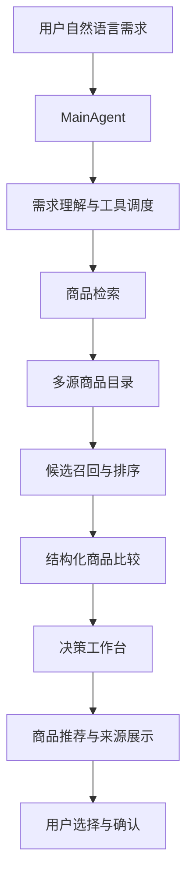
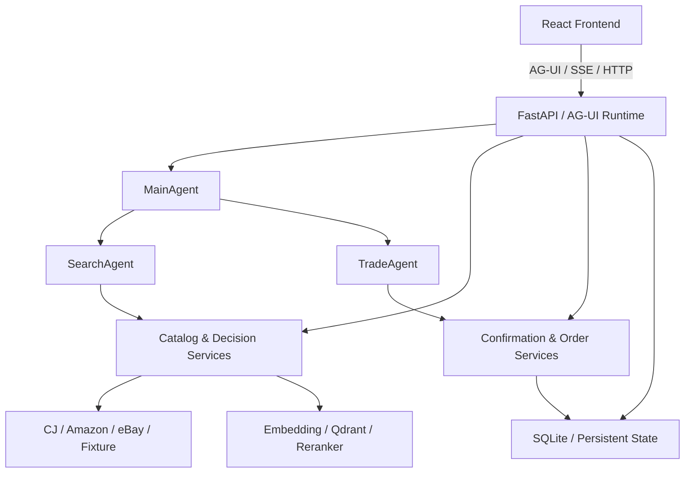

# Findora

**用对话发现好物，让每一次购买都有据可依。**

Findora 是一个面向跨境购物场景的 **AI Agent 智能选购与决策平台**，基于 **AgentScope 2.x、FastAPI、AG-UI 与 React** 构建。

不同于传统的关键词搜索和商品列表，Findora 将自然语言理解、Agent 工具协作、多平台商品检索、结构化比较和个性化购物决策整合为连续的交互体验。

用户只需要描述自己的需求，AI Agent 即可理解预算、用途、偏好与约束条件，调用商品与决策工具，并在交互界面中呈现商品卡片、对比结果及推荐依据。

**从“搜索商品”到“理解需求、筛选方案、辅助决策”，Findora 致力于探索下一代 Agentic Commerce 交互体验。**

### 项目导航

[核心能力](#核心能力) · [商品数据架构](#商品数据架构) · [快速开始](#快速开始) · [多平台数据接入](#多平台数据接入) · [系统架构](#系统架构) · [开发与验证](#开发与验证) · [技术文档](#技术文档)

---

## 核心能力

### 1. Conversational Commerce · 对话式智能选购

以自然语言作为购物入口，将用户的模糊需求转化为结构化的商品检索和购买决策任务。

- **自然语言需求理解**：识别预算、品类、用途及个人偏好。
- **Agent 驱动检索**：通过业务工具访问商品目录并筛选候选。
- **多轮交互优化**：支持追加要求、调整预算、重新检索和比较。
- **结构化商品展示**：在对话中呈现商品卡片、价格信息、来源与决策依据。
- **流式交互体验**：基于 AG-UI 实现 Agent 运行状态与前端界面的持续同步。

用户不需要自行组合复杂的筛选条件，可以直接提出：

> 帮我找一款适合通勤的双肩包，预算 500 元以内，优先考虑轻量、防水和电脑保护，并解释每款商品的优缺点。

Findora 将围绕用户需求组织检索、比较与决策过程，而不仅仅返回关键词匹配结果。

### 2. Multi-Source Commerce · 多平台商品聚合

Findora 提供可扩展的商品数据接入机制，支持整合来自不同海外电商平台的结构化商品信息。

当前支持的数据来源包括：

| 商品来源 | 数据接入方式 | 核心用途 |
|---|---|---|
| CJdropshipping | 商品快照及按需 API 查询 | 商品发现、详情补充与物流试算 |
| Amazon US | 本地商品数据快照 | 海外商品检索、价格与规格比较 |
| eBay US | 本地商品数据快照 | 多商家商品发现与报价参考 |
| Scenario Catalog | 内置版本化商品目录 | 完整业务流程与交易场景演示 |

通过统一的商品检索入口，系统可以在不同平台之间进行联合搜索、候选聚合、来源筛选与商品比较。

各平台数据保持独立来源标识，便于追踪商品出处、管理数据更新，并为后续扩展更多海外商城提供基础。

### 3. Evidence-Based Decisions · 证据驱动的购物决策

Findora 不仅关注商品是否符合搜索关键词，更重视推荐结果是否具备可核验的依据。

决策工作台支持：

- **多维商品对比**：围绕价格、规格、材质、库存和配送等信息进行比较。
- **候选聚焦**：每轮最多展示 5 个候选，减少无效信息干扰。
- **条件重新核验**：支持调整购买条件并重新评估候选。
- **商品溯源**：保留商品来源和检索证据。
- **结构化决策依据**：区分已知商品事实、规则估算与需要进一步确认的信息。

系统以工具返回的结构化数据作为决策基础，帮助用户理解推荐结果，而不只是接受一个缺乏解释的结论。

### 4. Personalized Shopping · 个性化购物体验

Findora 支持构建具备持续上下文的个人购物助手。

**长期偏好管理**

保存和召回用户的购物偏好，使后续推荐能够参考已经建立的个人需求。Agent 发起的记忆修改通过审批机制确认。

**Personal Skills**

用户可以通过 Markdown 创建自己的选购流程，并在对话中使用 `/` 指令选择相应 Skill。

例如，可以将常用的电子产品选购步骤保存为个人 Skill，在后续购物任务中重复使用。

**持久化会话**

系统保存对话、运行事件与相关状态，支持页面刷新后的会话恢复，以及流式运行期间的断线重连。

### 5. Human-in-the-Loop · 人机协同交易

Findora 在 Agent 自动化能力与用户控制权之间建立明确边界。

在 Scenario Sandbox 模式中，系统支持：

- 商品选择与购物决策
- 确认单生成
- 用户显式确认
- 本地订单创建
- 库存事务处理
- 订单取消与状态管理

交易过程采用持久化账本、幂等控制和库存事务机制，确保关键操作具有明确的执行条件。

对于外部商城，当前以商品发现、来源跳转和待购记录为主，最终购买由用户在对应平台完成。

### 6. Agent Engineering · 可扩展的 Agent 工程体系

Findora 不只是一个对话界面，而是一套持续演进的 AI Agent 应用工程实践。

| 技术组件 | 主要职责 |
|---|---|
| **AgentScope 2.x** | Agent 编排、工具调用与任务协作 |
| **FastAPI** | 后端业务服务与 API 接口 |
| **AG-UI / SSE** | Agent 流式事件与前端交互 |
| **React** | 商品展示、对话、比较与买家工作区 |
| **SQLite** | 本地业务数据、会话、事件和商品快照 |
| **Qdrant** | 向量索引与语义检索 |
| **Embedding / Reranker** | 语义召回与候选精排 |
| **Redis Streams** | 特定异步任务的队列处理 |
| **Docker Compose** | 本地服务编排与部署 |

系统同时提供运行事件持久化、状态恢复、业务护栏、回归测试及质量评测相关的工程能力。

---

## 商品数据架构

### Dual-Mode Catalog Architecture

Findora 采用双模式商品数据架构，在保持统一 Agent 交互体验的同时，支持不同阶段的业务验证与真实数据接入。

**Scenario Sandbox · 场景沙箱**

基于内置版本化商品目录，提供稳定、可复现的商品检索、选购决策和本地交易演示环境。

**Multi-Source Catalog · 多源商品目录**

以本地 SQLite 快照为数据基础，支持 CJdropshipping，并可叠加 Amazon US、eBay US 的商品数据，实现跨平台联合检索与比较。

### 商品模式能力矩阵

| 核心能力 | Scenario Sandbox (`fixture`) | Multi-Source Catalog (`cj`) |
|---|---|---|
| 商品数据 | 内置版本化商品目录 | CJ / Amazon / eBay 本地快照 |
| 商品检索 | 场景化检索与决策演示 | 多源联合检索与来源筛选 |
| 商品比较 | 演示商品结构化比较 | 跨平台候选与报价比较 |
| 价格与库存 | 本地规则管理 | 保留商品采集时的价格与库存信息 |
| 物流与费用 | 演示运费及税费估算 | CJ 按需物流试算及来源信息展示 |
| 购买体验 | 本地确认单与订单事务 | 外部商城跳转、CJ 待购记录 |
| 数据扩展 | 可复现的业务场景 | 支持追加商品快照来源 |

多源模式通过配置启用相应商品快照，无需修改前端交互流程。

### 检索与决策流程



Findora 将商品来源、检索结果和决策过程组织为可追踪的交互链路。

在快照目录模式中，商品信息以最近一次导入的数据为基础；CJ 可进一步提供按需详情及物流试算。不同平台的报价可供参考，跨境最终费用和严格同款关系需依据实际商品信息进一步核验。

---

## 快速开始

Findora 支持本地开发环境及 Docker Compose 部署。

### 环境要求

- Python **3.11–3.13**
- [uv](https://docs.astral.sh/uv/)
- Node.js **22**
- npm
- 支持 Tool Calling 与 Streaming 的模型服务
- 可用的 Embedding 模型服务

本地默认使用 SQLite 和嵌入式 Qdrant。常规网页对话无需单独启动 Redis。

### 1. 克隆项目

```bash
git clone https://github.com/yzhsqq/Findora.git
cd Findora
```

安装后端与前端依赖：

```bash
uv sync --frozen
npm --prefix frontend ci
```

### 2. 配置模型服务

复制环境配置模板。

Windows PowerShell：

```powershell
Copy-Item .env.example .env
```

macOS / Linux：

```bash
cp .env.example .env
```

编辑 `.env`：

```dotenv
# LLM
LLM_BASE_URL=https://dashscope.aliyuncs.com/compatible-mode/v1
LLM_API_KEY=your-api-key
LLM_MODEL=qwen3-max
LLM_FALLBACK_MODEL=qwen-plus

# Embedding
EMBEDDING_MODEL=text-embedding-v4

# Catalog
CATALOG_SOURCE=fixture
DATA_DIR=./data

# Retrieval
HYBRID_RECALL_ENABLED=0
```

以上模型配置为项目示例，使用前请确保服务账号具有相应模型和额度。

Embedding 默认复用聊天模型的服务地址与密钥。如需接入独立服务，可额外设置：

- `EMBEDDING_BASE_URL`
- `EMBEDDING_API_KEY`
- `EMBEDDING_MODEL`
- `EMBEDDING_DIM`

如果不使用备用模型，可将 `LLM_FALLBACK_MODEL` 留空。

建议将密钥仅保存在本地 `.env` 或服务端环境变量中，不要提交至版本仓库。

### 3. 启动后端

```bash
uv run python -m uvicorn app.presentation.server:app --host 127.0.0.1 --port 8000 --workers 1
```

启动成功后：

- Health Check：http://127.0.0.1:8000/health
- OpenAPI Docs：http://127.0.0.1:8000/docs

首次启动时可能需要生成商品和知识库向量，因此会产生相应的 Embedding 调用。

本地嵌入式 Qdrant 采用单进程访问方式。需要独立向量服务时，可以配置 `QDRANT_URL`。

### 4. 启动前端

打开新的终端：

```bash
npm --prefix frontend run dev -- --host 127.0.0.1 --port 5173 --strictPort
```

浏览器打开：

http://127.0.0.1:5173

开发模式默认将 `/commerce` 和 `/health` 请求代理到后端。

### 5. 体验 AI Agent

可以直接输入：

> 预算 300 元以内，帮我挑一款适合通勤的轻便背包，优先考虑防水、电脑保护和舒适性，并说明推荐依据。

随后可以继续：

- 追加需求或修改预算
- 查看和比较商品候选
- 收藏商品
- 保存购物偏好
- 生成购买确认单
- 在样例模式中执行本地演示订单

实际推荐结果以当前商品目录与模型输出为准。

默认演示身份为 `findora-guest`，对应 `IDENTITY_MODE=demo`。需要进一步接入身份验证时，可参考 [会话与身份模式](docs/会话持久Fencing与身份模式.md)。

---

## 多平台数据接入

Findora 将商品数据采集与 Agent 检索运行解耦，通过结构化商品快照连接外部电商数据源。

商品快照文件不包含在公开源码仓库中，开发者可以使用自己获得的商品数据完成导入。

### CJdropshipping

根据 [CJ 商品采集说明](docs/CJ数据采集.md) 准备商品快照。

在 `.env` 中配置：

```dotenv
CATALOG_SOURCE=cj
CJ_CATALOG_PATH=./data/cj_catalog.sqlite3
```

重启后端后，即可启用 CJ 商品目录。

如需商品详情补充与物流报价，可进一步配置 CJ API，参考：

[CJ 详情与报价试点](docs/CJ-quote-pilot-2026-09-29.md)

### Amazon US

将符合项目导入格式的 Amazon JSON 数据转换为本地 SQLite 商品快照：

```bash
uv run python scripts/import_amazon_catalog.py \
  --input path/to/amazon.json \
  --output data/amazon_catalog.sqlite3 \
  --merge
```

支持批次合并与数据导入校验。

详见 [Amazon 商品快照文档](docs/amazon-catalog.md)。

### eBay US

通过对应导入工具建立 eBay 商品快照：

```bash
uv run python scripts/import_ebay_catalog.py \
  --input path/to/ebay.json \
  --output data/ebay_catalog.sqlite3 \
  --merge
```

详见 [eBay 商品快照文档](docs/ebay-catalog.md)。

两个导入脚本均支持 `--merge` 保留已有批次；不指定该选项时，将按工具的替换逻辑处理目标快照。对于异常记录，可参考相应文档中的 `--skip-invalid` 参数。

### 启用多平台商品检索

在已有 CJ 快照基础上配置：

```dotenv
CATALOG_SOURCE=cj

CJ_CATALOG_PATH=./data/cj_catalog.sqlite3
AMAZON_CATALOG_PATH=./data/amazon_catalog.sqlite3
EBAY_CATALOG_PATH=./data/ebay_catalog.sqlite3
```

启用后，Findora 可以在统一检索流程中使用已配置的商品目录。

`CATALOG_SOURCE` 当前支持 `fixture` 和 `cj` 两种取值。Amazon / eBay 通过额外路径启用，对应路径留空即可关闭该数据来源。

### 商品本地化

针对面向中文用户的跨境购物场景，项目提供商品数据本地化工具：

```text
scripts/localize_amazon_catalog.py
scripts/localize_ebay_catalog.py
```

本地化流程使用模型服务处理商品展示文本，并将结果存储为独立投影。

原始商品事实保留，便于后续校验、复核与展示。

### 混合检索与精排

Findora 支持关键词检索与可选的语义检索增强机制。

```dotenv
HYBRID_RECALL_ENABLED=1
```

启用后，可结合：

- 关键词匹配
- Embedding 向量召回
- Qdrant 向量索引
- 多平台候选合并
- 可选 HTTP Reranker 精排

各平台采用独立向量集合，联合检索时先整合候选，再根据配置执行统一精排。

在 `HYBRID_RECALL_ENABLED=0` 时，商品快照采用关键词检索。

直接目录浏览与商品编号查询不经过精排。检索策略、模型维度和索引配置的具体说明可查看相关技术文档。

---

## 系统架构

### Multi-Agent Architecture

Findora 采用分层业务架构，围绕 Agent 协作、工具调用、商品检索与交易用例组织系统能力。



### Agent 职责

| Agent | 职责 |
|---|---|
| **MainAgent** | 需求协调、上下文组织、工具调用 |
| **SearchAgent** | 商品检索、选品与候选发现 |
| **TradeAgent** | 本地确认、交易流程与业务规则协同 |

### 后端分层

项目代码按领域、应用、基础设施与接口进行组织，并通过 `app/composition.py` 集中完成依赖装配。

| 目录 | 职责 |
|---|---|
| `app/domain/` | 领域模型、值对象、业务规则与接口 |
| `app/application/` | Agent、业务工具、应用用例与运行护栏 |
| `app/infrastructure/` | 模型、商品快照、存储、索引、缓存与追踪 |
| `app/presentation/` | FastAPI、AG-UI、商品与买家接口 |
| `app/composition.py` | API / Worker 依赖装配及生命周期 |
| `frontend/src/` | React 页面、客户端与交互状态 |
| `scripts/` | 采集导入、本地化、评测与运维 |
| `knowledge/` | 商品品类知识与选购参考 |
| `tests/` | 后端回归测试 |
| `frontend/tests/` | 前端测试 |
| `eval/` | Agent 评测协议、场景与结果 |
| `docker/` | 容器与服务编排 |
| `docs/` | 系统设计与实现文档 |

### 流式运行与持久状态

网页对话主链路通过：

```http
POST /commerce/ag-ui/run
```

执行 Agent 运行，并将相关事件记录至持久存储。

系统支持：

- AG-UI 流式事件
- 前端运行状态同步
- 会话持久化
- 页面刷新后的状态恢复
- 流式运行断线重连
- 业务操作幂等控制

Redis Streams Worker 用于既有意图接口的异步任务处理；网页 AG-UI 主运行链路仍由 API 进程执行。

---

## Docker 部署

项目提供 Docker Compose 编排配置，便于快速启动完整开发环境。

首先准备根目录 `.env`，然后执行：

```bash
docker compose --env-file .env \
  -f docker/docker-compose.yaml \
  up -d --build
```

基础服务包括：

- Frontend
- Backend API
- Redis
- Qdrant
- Queue Worker

启动后：

- Frontend：http://localhost:5173
- Backend：http://localhost:8000

基础编排默认使用聊天服务提供的 Embedding 配置。

如使用独立 Embedding 服务，应补充对应容器环境变量映射。

CJ、Amazon 和 eBay 商品快照通过额外配置或数据挂载接入，具体方式可参考相关平台文档。

---

## 开发与验证

Findora 配备后端、前端及 Agent 相关的测试与验证工具。

### 后端测试

```bash
uv run python -m pytest -q
```

### 前端测试

```bash
npm --prefix frontend test
```

### 生产构建

```bash
npm --prefix frontend run build
```

部分测试依赖外部服务或指定运行开关。完整 Agent 质量评测需要相应模型服务与评测配置。

### 工程配置

主要配置入口：

- [.env.example](.env.example)
- [Settings](app/infrastructure/settings.py)

前后端分离部署时，可通过 `VITE_API_BASE` 配置前端 API 地址；本地开发代理目标可通过 `API_PROXY_TARGET` 调整。

服务端密钥不应放入 `VITE_*` 变量，避免进入浏览器构建产物。

如需调整 Embedding 模型维度，应同步设置 `EMBEDDING_DIM`，并使用新的 `QDRANT_COLLECTION` 重建索引。

已有数据目录升级前建议完成备份。对于历史 `globex.db` 与当前 `findora.db`，可使用 `DATABASE_URL` 显式指定目标数据库，避免切换存储时产生混淆。

---

## 项目状态与演进方向

Findora 是一个持续迭代的开源 AI Agent 工程项目。

目前已经实现的主要能力包括：

- 全栈对话式商品选购体验
- Agent 工具协作与结构化商品决策
- CJ / Amazon / eBay 商品快照接入
- 多平台联合检索与候选比较
- 个人 Skill 与长期偏好
- 会话持久化及流式恢复
- 本地演示交易与事务控制
- 自动化测试与质量评测基础设施

### 持续演进

项目后续将重点围绕以下方向完善：

**Commerce Data**

持续提升商品数据接入、更新与多平台标准化能力。

**Product Intelligence**

完善跨平台同款识别、规格归一化及商品匹配质量。

**Global Shopping**

加强国际物流、汇率、税费与最终购买成本的核验能力。

**Agent Reliability**

持续提升检索质量、Agent 决策一致性、评测覆盖和生产运行稳定性。

### 数据与交易说明

为保证购物决策的透明性，Findora 对不同类型的数据采用明确的处理边界。

- **商品快照**：展示最近一次采集的数据，不将其视为商城实时价格或库存。
- **跨平台比较**：支持不同来源候选的综合比较；严格同款匹配仍需进一步核验。
- **跨境费用**：CJ 可按需试算物流，Amazon / eBay 的国际运费及税费需要额外确认。
- **外部购买**：当前支持跳转来源商城，不直接执行 Amazon / eBay 外部订单。
- **本地交易**：Scenario Sandbox 中的订单与库存操作属于本地演示流程，须由用户明确确认后执行。

项目持续保留质量验证记录，以便追踪版本演进。历史 [2026-09-09 正式 Release 验证](docs/正式release验证记录-2026-09-09.md)结论为 `BLOCKED`，适用于当时的冻结版本；后续修复、回归结果和正式发布验收分别记录。

---

## 技术文档

Findora 提供覆盖系统架构、Agent 运行、数据处理、持久化、交易一致性和质量评测的工程文档。

| 主题 | 相关文档 |
|---|---|
| 架构与设计 | [设计演进记录](docs/设计演进记录.md) · [教程实现对齐清单](docs/教程实现对齐清单.md) |
| 多平台商品数据 | [CJ 采集](docs/CJ数据采集.md) · [Amazon](docs/amazon-catalog.md) · [eBay](docs/ebay-catalog.md) |
| CJ 商品服务 | [详情补充](docs/cj-enrichment.md) · [报价试点](docs/CJ-quote-pilot-2026-09-29.md) |
| AG-UI 与事件流 | [首版接入](docs/AG-UI首版接入.md) · [持久运行与恢复](docs/AG-UI持久运行与断线恢复-2026-09-09.md) |
| 会话与身份 | [Fencing 与身份模式](docs/会话持久Fencing与身份模式.md) |
| Personal Skills | [Skill 与长期记忆](docs/买家自写Skill与长期记忆-2026-09-09.md) |
| 上下文管理 | [分层治理与评测](docs/上下文分层治理与评测-2026-09-10.md) |
| 交易一致性 | [订单管理与语义长期记忆](docs/订单管理与语义长期记忆-2026-09-09.md) |
| Prompt 工程 | [Prompt 版本发布](docs/Prompt版本与人工发布.md) |
| 可观测性 | [Langfuse 与 Trace](docs/Langfuse与端到端Trace.md) |
| 质量评测 | [正式评测选集](docs/正式评测选集与证据清单.md) · [Release 验证](docs/正式release验证记录-2026-09-09.md) |

---

## 常见问题

**Q：可以接入自己采集的 Amazon / eBay 商品数据吗？**

可以。将商品数据整理为项目支持的 JSON 格式，通过对应导入脚本转换为 SQLite 快照，然后配置数据路径即可。

**Q：必须安装 Redis 才能启动吗？**

本地常规网页对话无需 Redis。涉及相应异步队列与 Docker 完整编排时，可以使用 Redis Streams。

**Q：支持中文商品搜索和展示吗？**

支持中文对话与商品检索流程，并提供 Amazon、eBay 商品本地化工具。实际检索效果与导入数据、翻译结果及检索配置有关。

**Q：为什么切换商品目录后没有搜索结果？**

先检查商品快照路径、数据导入状态与检索配置。对于向量检索，还需要确认对应 Qdrant 索引已建立。

**Q：可以直接购买 Amazon / eBay 商品吗？**

目前平台提供商品发现、比较和来源跳转，用户在对应海外商城完成购买。完整本地订单流程可通过 Scenario Sandbox 体验。

**Q：能否接入其他海外电商平台？**

项目采用独立商品快照与目录接入机制，可以在现有数据模型和导入流程基础上扩展新的商品来源。

---

## Vision

### The future of shopping is conversational, personalized, and evidence-driven.

Findora 探索的不只是商品搜索，而是一种更加自然、透明和个性化的购物交互方式。

通过 AI Agent、结构化商品数据、可追踪的决策依据与用户主导的确认流程，让智能系统从简单的信息检索工具，逐步演进为真正能够辅助用户完成复杂购物决策的数字助手。

**Findora — Discover with conversation. Decide with evidence.**
