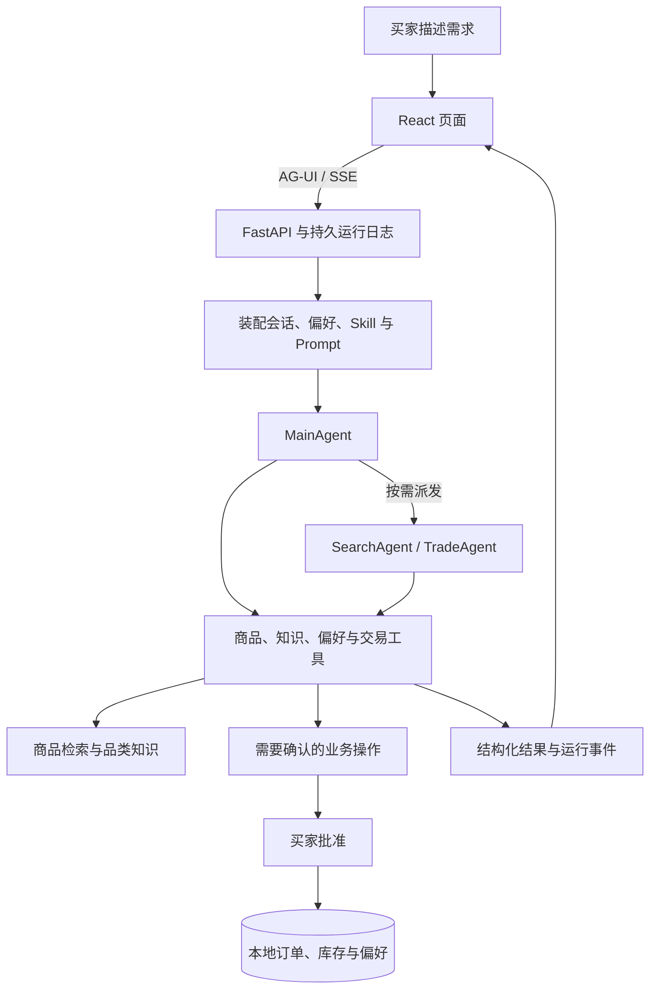

# Globex · 从商品检索到交易确认的电商 Agent

一个基于 **AgentScope、AG-UI 和 React** 的全栈 Agent 实战项目，覆盖需求理解、商品检索、方案比较与交易确认。

在完整选购流程中，探索 Agent 应用的关键工程问题：如何调用业务工具、记住用户偏好、管理长对话，以及在刷新、断线和人工审批之间保持状态一致。

[快速开始](#快速开始) · [核心能力](#核心能力) · [工作原理](#工作原理) · [项目状态](#项目状态) · [开发与文档](#开发与文档)

> 当前使用版本化样例商品目录和本地订单账本，尚未接入真实电商供给、支付或物流。部分正式质量评测尚未通过，具体范围见[项目状态](#项目状态)。

## 一次选购，从描述需求开始

你可以先告诉 Globex：

> 预算 300 元以内，帮我找一个寄到中国的轻便背包。

Agent 根据需求调用检索与业务工具，页面随运行过程展示回答和结构化商品卡。你可以继续比较、补充条件，或生成交易确认单。

| 你可以这样说 | 对应的交互 |
| --- | --- |
| “比较刚才两个候选，重点看重量和容量。” | 查看候选商品的差异，继续缩小选择范围 |
| “记住我偏好轻便设计。” | 展示记忆变更审批，批准后保存偏好 |
| “这次不要黑色，换几个其他颜色的。” | 在当前选购中更新需求 |
| “为我选中的商品生成确认单。” | 查看交易信息，明确批准后执行本地订单与库存事务 |

常用的选购方法也可以写成个人 Skill。例如，将“先确认用途，再筛选预算，最后比较重量和容量”保存为 Markdown 步骤，在对话中输入 `/` 选择使用。

实际回答和候选商品取决于样例目录、模型与检索配置。

## 技术栈

基于 **Python + TypeScript** 构建，使用 **AgentScope 2.x** 编排 Agent，通过 **AG-UI** 将执行过程与结构化结果实时呈现在 React 页面。

| 层次 | 技术选型 | 在项目中的用途 |
| --- | --- | --- |
| Agent 框架 | AgentScope 2.x | Agent 执行、工具调用、子 Agent 派发、Middleware 与人工审批 |
| 后端服务 | Python 3.11–3.13、FastAPI、Uvicorn | 业务 API、Agent 运行入口与流式响应 |
| 前端应用 | React 18、TypeScript、Vite | 对话界面、商品卡、Skill 编辑、偏好管理与订单页面 |
| 交互协议 | AG-UI、SSE | 传输文本、工具调用与状态事件，配合持久日志实现重连和重放 |
| 模型接入 | OpenAI 兼容 API | 聊天模型、工具调用与流式生成；示例配置使用通义千问 |
| 商品检索 | Embedding、Qdrant、HTTP Reranker | 商品向量召回与精排，支持降级到向量排序或关键词检索 |
| 品类知识 | Markdown、AgentScope KnowledgeBase | 管理品类知识，为选购与比较提供参考 |
| 持久化 | SQLite、本地文件 | 保存会话、运行事件、偏好、Skill、确认单、订单与库存 |
| 缓存与队列 | Redis、Redis Streams | 缓存、共享限流，以及旧意图接口的异步任务消费 |
| 可观测性 | OpenTelemetry、OTLP、Langfuse | 关联 API、Agent、模型和工具调用，记录运行追踪与评分 |
| 测试与评测 | 后端/前端回归测试、自定义评测脚本 | 验证业务行为，评估商品检索、知识检索、Agent 与上下文治理效果 |
| 构建与部署 | uv、npm、Docker Compose、Nginx | 依赖管理、全栈部署、静态资源服务与 API 反向代理 |

### 工程设计

- **业务分层**：采用 DDD 洋葱架构，分离领域模型、应用用例、基础设施与接口层，通过 `composition.py` 统一装配依赖。
- **Agent 协作**：MainAgent 直接处理简单任务，需要任务拆分或上下文隔离时，按需派发给 SearchAgent、TradeAgent。
- **上下文与记忆**：结合语义偏好召回、Skill 按需加载、工具证据保存与上下文裁剪、摘要。
- **可靠性机制**：使用事务、幂等控制、会话 lease/fencing/CAS，以及持久运行日志，处理重复请求、并发写入与断线恢复。


## 核心能力

### 结构化选购

商品检索、品类知识与交易工具共同支持选购流程。页面直接消费工具和业务系统返回的结构化数据，展示商品卡、规格和确认单。

预算等硬约束由代码过滤；价格、库存和订单状态依据业务数据展示。

商品向量索引按商品检索文本与 embedding 模型计算指纹，指纹保存在 Qdrant 记录中。首次建库或旧索引升级时会生成向量；后续启动只处理新增、检索文本变化和已删除商品。价格、库存变化不会触发商品重新向量化。同步按批进行，异常时保留已有索引，并在本进程禁用向量召回、降级关键词检索；`GET /health` 的 `runtime.product_index` 可查看本次同步状态。若更换为不同维度的向量模型，需要为 `QDRANT_COLLECTION` 指定新集合完成迁移。

当前商品目录仍是版本化样例文件；增量索引解决重复计算，不代表已接入外部商家的实时商品、价格和库存。

### 购买决策工作台（V2）

每次商品检索后，页面生成一份可追溯的决策单，按检索顺序最多展示 **5 个候选**。决策单逐项核对库存、品类、配送、材质和预算，保留未入选原因与尚不确定的信息；商品事实指向该轮检索证据，估算到手价明确标为规则估算。

可以在决策单上调整关键词、目的地、材质和预算，重新检索并核验。预算可选择仅比较商品价，或比较商品、运费与关税合计的估算到手价；后者需要先指定配送目的地。刷新会话后可恢复最近一次条件调整结果。接口为 `POST /commerce/decisions/preview` 与 `GET /commerce/decisions/preview`，作用域限定为当前买家和会话。

`eval/v2/decision_cases.jsonl` 提供固定场景，`scripts/eval/decision_quality.py` 检查候选上限、硬条件、报价和证据的一致性；这属于决策单契约检查，不表示正式检索或 Agent 效果门禁已经通过。商品、库存及估算规则仍来自演示数据，实际购买需重新确认。

### 个人 Skill 与长期偏好

用 Markdown 编写自己的选购流程，按需加载到对话中。个人 Skill 仅对当前买家可用，指导现有工具的使用，不扩展工具权限。

长期偏好支持添加、修改和删除。正向偏好按语义召回，负向约束保留用于后续选购；偏好变更记录版本与来源。

### 人工确认与交易一致性

对话中的记忆变更和交易操作通过确认流程执行。买家可以批准或拒绝，待审批状态可在刷新后恢复。

本地订单、库存与幂等记录通过数据库事务处理。页面直接编辑偏好属于显式操作，无需重复走 Agent 审批。

### 持久会话与运行恢复

会话、消息和运行事件保存在服务端。刷新或断线后，前端可以恢复已有内容，继续订阅运行结果。

断开网页不会自动取消本轮任务；点击“停止”才明确取消。API 重启后，未完成运行会标记为中断，已保存内容仍保留。

### 上下文治理与工程评测

工具完整证据与提供给模型的上下文分开保存。长对话支持裁剪、摘要和证据回查，页面提供“整理上下文”与选购摘要。

工程包含回归测试、检索评测、Agent 用例与运行证据。功能实现、测试通过和效果达标分别记录。

## 快速开始

**推荐先使用 AI 帮忙启动！！**

在编程助手中打开 `globex-agent` 工程目录，可以使用以下提示：

> 帮我启动这个项目。先阅读 README 和现有配置，检查环境与端口，保留已有 .env 和数据。安装缺失依赖，启动前后端，检查健康接口并完成一次页面选购。缺少模型凭据时说明需要配置哪些字段，不要打印密钥。最后告诉我访问地址和停止服务的方法。

启动步骤：
推荐先使用本机模式：启动一个后端和一个前端。

默认使用 SQLite 与本地 Qdrant，不需要预先部署 MySQL、Redis 或 Langfuse。

### 1. 准备环境

- Python 3.11–3.13
- uv
- Node.js 22 与 npm
- 可用的模型 API 凭据

聊天模型服务需要支持 OpenAI 兼容协议、工具调用和流式输出。向量检索还需要可用的 embedding 服务。

以下命令均在包含 `pyproject.toml` 和 `frontend/` 的 `globex-agent` 工程根目录执行：

```bash
uv sync --frozen
npm --prefix frontend ci
```

### 2. 配置模型

首次使用时创建 `.env`，已有配置不会被覆盖：

```bash
if [ ! -f .env ]; then
  cp .env.example .env
fi
```

编辑 `.env`，填写模型服务信息：

```dotenv
LLM_BASE_URL=https://dashscope.aliyuncs.com/compatible-mode/v1
LLM_API_KEY=填写你的真实密钥
LLM_MODEL=qwen3-max
LLM_FALLBACK_MODEL=qwen-plus
EMBEDDING_MODEL=text-embedding-v4
```

以上为配置示例，模型名称应替换为当前账户实际可用的模型。

Embedding 默认复用聊天模型的网关和密钥。需要独立服务时，配置 `EMBEDDING_BASE_URL`、`EMBEDDING_API_KEY` 和对应模型。

> 模型与 embedding 调用可能产生费用。首次启动会加载商品目录并尝试建立向量索引，耗时取决于服务与网络。密钥只保存在本机或服务端，不要提交到仓库。

### 3. 启动后端

在终端一执行：

```bash
uv run python -m uvicorn app.presentation.server:app \
  --host 127.0.0.1 \
  --port 8000 \
  --workers 1
```

本地 Qdrant 对数据目录持有进程锁，使用此模式时保持单个后端进程，不要让另一个后端或 worker 同时打开相同向量目录。

### 4. 启动前端

在终端二执行：

```bash
npm --prefix frontend run dev -- \
  --host 127.0.0.1 \
  --port 5173 \
  --strictPort
```

打开 [http://127.0.0.1:5173](http://127.0.0.1:5173)。

前端默认代理 API 请求到 `http://127.0.0.1:8000`。

### 5. 完成第一次选购

检查后端健康状态：

```bash
curl --fail http://127.0.0.1:8000/health
```

然后在页面发送：

> 预算 300 元以内，找一个寄到中国的轻便背包。

观察流式回答、商品卡和运行记录。健康检查通过不代表模型与检索服务全部可用，页面交互才是首次体验的最后一步。

接口文档：[http://127.0.0.1:8000/docs](http://127.0.0.1:8000/docs)。


<details>
<summary>使用 Docker Compose 启动</summary>

准备 Docker Engine/Desktop、Compose v2，以及工程根目录下的 `.env`。

```bash
docker compose --env-file .env -f docker/docker-compose.yaml config --quiet
docker compose --env-file .env -f docker/docker-compose.yaml up -d --build
docker compose --env-file .env -f docker/docker-compose.yaml ps
```

访问 [http://127.0.0.1:5173](http://127.0.0.1:5173)。

Compose 包含 API、worker、Redis、Qdrant 和静态前端。容器使用命名卷，不会自动读取本机 `data/` 中的会话与订单。

已有 `.env` 中的路径、数据库地址与 Prompt 版本需要适配容器环境。独立 embedding 网关和密钥还需在 Compose 中显式透传给 `app` 和 `worker`。

查看日志：

```bash
docker compose --env-file .env -f docker/docker-compose.yaml logs --tail 100 app worker
```

停止服务并保留数据：

```bash
docker compose --env-file .env -f docker/docker-compose.yaml down
```

不要添加 `-v`，该参数会删除命名卷。

</details>

## 工作原理



| 层次 | 职责 |
| --- | --- |
| 交互层 | React 展示对话、商品卡、个人 Skill、偏好与审批 |
| 传输层 | AG-UI 事件流、运行日志、游标重连与历史恢复 |
| Agent 层 | MainAgent 处理任务，按需派发给 SearchAgent 和 TradeAgent |
| 业务层 | 检索、确认、订单、库存与偏好的用例和约束 |
| 基础设施层 | 模型、向量检索、SQLite、Redis 与可观测性适配 |

简单任务由 MainAgent 直接调用工具；需要任务拆分或上下文隔离时，再使用子 Agent。

当前网页的 AG-UI 请求在 API 进程执行。Redis worker 服务于旧意图接口和异步任务入口，开启队列不会自动把网页请求转交 worker。

更详细的实现说明见[设计演进记录](docs/设计演进记录.md)与[教程实现对齐清单](docs/教程实现对齐清单.md)。

## 配置与数据

完整配置以 [.env.example](.env.example) 和 [settings.py](app/infrastructure/settings.py) 为准。

| 配置 | 用途 |
| --- | --- |
| `LLM_BASE_URL`、`LLM_API_KEY`、`LLM_MODEL` | 聊天模型服务 |
| `EMBEDDING_BASE_URL`、`EMBEDDING_API_KEY`、`EMBEDDING_MODEL` | 向量模型服务 |
| `RERANKER_BASE_URL`、`RERANKER_MODEL` | 可选精排服务；缺失会影响正式检索质量门禁 |
| `QDRANT_URL` | 使用服务端 Qdrant；本地模式可不配置 |
| `REDIS_URL`、`QUEUE_ENABLED` | Redis 与旧意图队列 |
| `LANGFUSE_BASE_URL`、`LANGFUSE_PUBLIC_KEY`、`LANGFUSE_SECRET_KEY` | 可选运行追踪 |
| `DATA_DIR` | 本地持久数据目录 |
| `IDENTITY_MODE` | 演示身份或签名身份校验 |
| `API_PROXY_TARGET` | 前端开发服务代理的后端地址 |

环境变量优先于根目录 `.env`。所有 `VITE_*` 配置都可能进入浏览器构建产物，不能存放服务端密钥。

默认数据保存在工程 `data/` 下，包括会话、运行事件、偏好、Skill、订单和向量索引。浏览器缓存用于加速展示，服务端是持久数据来源。

默认演示用户为 `pao-coder`，无需登录。当前演示模式不提供完整账号系统，不能直接作为面向公网的多用户身份方案。

不要通过删除 `data/` 解决启动问题。备份前可停止写入进程，再复制整个数据目录。

## 项目状态

以下区分功能实现与验证范围。阶段记录中的通过结果，不代表所有配置和业务场景都已达标。

| 范围 | 当前状态 | 说明与证据 |
| --- | --- | --- |
| 页面选购、个人 Skill 与长期偏好 | 已实现，保留阶段验证记录 | [实施与验证总记录](docs/全计划实施与验证记录-2026-09-09.md) |
| 购买决策工作台（V2） | 已实现，固定场景契约回归通过 | 最多 5 件候选，证据、预算口径和未知项；[V2 评测说明](eval/v2/README.md) |
| 工具审批与记忆维护 | 已实现 | [原生确认与记忆维护](docs/原生工具确认与记忆维护升级-2026-09-09.md) |
| 订单管理与语义长期记忆 | 已实现 | [订单与记忆记录](docs/订单管理与语义长期记忆-2026-09-09.md) |
| 持久运行与断线恢复 | 已实现 | [运行恢复说明](docs/AG-UI持久运行与断线恢复-2026-09-09.md) |
| 上下文分层治理 | 二轮专项验收通过，范围见记录 | [专项验收证据](eval/verification/context-v2-20260910/README.md) |
| 正式检索与 Agent 质量门禁 | 仍有未通过项 | [正式 release 记录](docs/正式release验证记录-2026-09-09.md) |
| Hybrid 检索及策略收益 | 尚未证明收益 | 不作为效果承诺 |
| 真实支付、物流与完整账号系统 | 未接入 | 当前用于本地体验与工程实践 |

验证结果应结合对应日期、代码版本、模型和数据集阅读。测试通过数量不替代业务质量评测；特定长对话实验的 token 变化不代表所有场景的成本收益。

## 开发与文档

### 工程目录

```text
app/
  domain/          领域模型与端口
  application/     Agent、工具、用例与执行约束
  infrastructure/  模型、检索、存储、队列与观测
  presentation/    FastAPI、AG-UI 与业务接口
  composition.py   依赖装配
  worker.py        Redis 意图消费者

frontend/          React 页面与前端测试
knowledge/         品类知识与来源清单
data/              样例商品与本地运行数据
scripts/           冒烟、评测和管理工具
tests/             后端回归测试
eval/              评测用例与验收证据
docs/              设计、使用与验证文档
docker/            Compose 配置
```

### 文档导航

| 想了解什么 | 从这里开始 |
| --- | --- |
| 当前交付范围与剩余问题 | [实施与验证总记录](docs/全计划实施与验证记录-2026-09-09.md) |
| 教程与代码如何对应 | [教程实现对齐清单](docs/教程实现对齐清单.md) |
| Skill 与长期偏好如何工作 | [买家自写 Skill 与长期记忆](docs/买家自写Skill与长期记忆-2026-09-09.md) |
| 长对话如何整理与评测 | [上下文分层治理与评测](docs/上下文分层治理与评测-2026-09-10.md) |
| 刷新与断线如何恢复 | [AG-UI 持久运行](docs/AG-UI持久运行与断线恢复-2026-09-09.md) |
| 如何处理交易确认和库存 | [交易确认与库存验证](docs/交易确认与库存验证-2026-09-09.md) |
| 如何配置身份与会话隔离 | [会话与身份模式](docs/会话持久Fencing与身份模式.md) |
| 如何观察 Agent 执行过程 | [Langfuse 与端到端 Trace](docs/Langfuse与端到端Trace.md) |
| 如何理解正式质量门禁 | [正式评测选集与证据清单](docs/正式评测选集与证据清单.md) |

运行评测前，请先阅读对应文档，确认模型、数据集和外部服务前提。部分验证会调用模型并产生费用。

## 常见问题

**健康检查通过，为什么对话仍然失败？**

健康接口不覆盖所有模型、embedding 和精排服务。检查模型权限、网关配置及后端日志，并通过一次真实页面交互确认链路。

**首次启动为什么较慢？**

服务会加载样例目录并尝试建立向量索引。耗时与 embedding 服务、网络和已有索引状态有关。

**本地 Qdrant 提示目录被占用怎么办？**

检查是否有另一个后端或 worker 正在使用同一目录。本地模式保持单进程；多进程部署使用 Qdrant 服务端。

**刷新页面后，Agent 会停止吗？**

刷新只会断开订阅，服务端当前运行继续执行。点击“停止”才会取消。API 进程重启后的未完成运行会标记为中断。

**为什么新安装没有公共 Skill？**

公共 Skill 属于运行态发布数据，不随源码自动发布。可以先在“我的 Skill”中创建个人方案。

**能直接部署为真实电商服务吗？**

目前使用样例商品、本地订单与演示身份，正式质量门禁也仍有未通过项。接入真实业务前，需要完成供给、支付、物流、身份和目标场景的独立验证。

## 后续方向

- 完成正式检索与 Agent 质量门禁中的剩余问题。
- 验证 Hybrid 检索、A/B 与不同策略的实际收益。
- 补齐 worker 路径的远端追踪验收。
- 探索完整账号体系与真实业务系统接入。

具体工作范围与验收标准见[设计与实施计划](docs/待实现设计与实施计划-2026-09-09.md)。

## 参与贡献

欢迎提交问题、改进文档、补充失败用例，或完善具体功能。

报告问题时，请说明运行方式、复现步骤、预期结果与实际结果，并提供脱敏后的日志。不要附带 API 密钥、身份令牌或个人订单数据。

涉及检索、记忆或 Agent 行为的修改，请同时说明验证场景与效果；新增外部依赖时，请补充配置、费用和降级行为。

## 许可证

许可证信息待正式发布前确认并补充。
