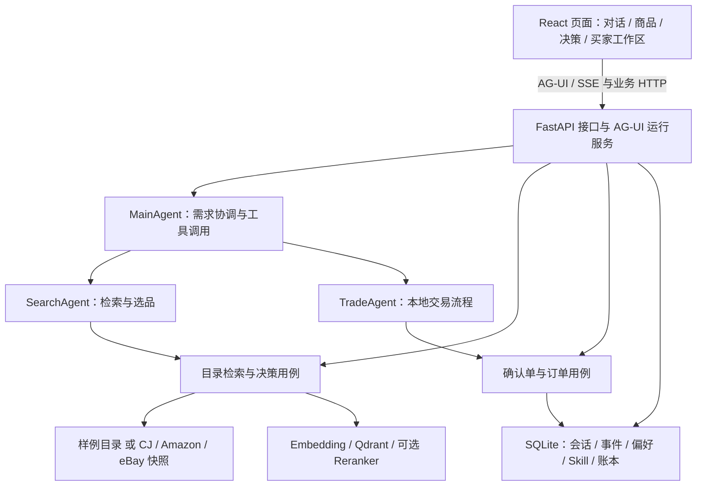

# Findora

**用对话寻找商品，用证据做购买决策。**

Findora 是一个基于 **AgentScope 2.x、FastAPI、AG-UI 与 React** 的跨境电商 Agent 项目。它把需求理解、商品检索、规格比较、个人偏好和人工确认连接起来：用户描述需求，Agent 调用业务工具，页面同步展示回答、商品卡和决策依据。

项目提供两种运行方式：使用内置样例商品体验完整的本地交易流程，或接入 **CJdropshipping、Amazon 美国站、eBay 美国站** 的本地商品快照，进行选品和比较。

[快速开始](#快速开始) · [功能与边界](#功能与边界) · [接入商品快照](#接入商品快照) · [架构](#架构) · [开发与验证](#开发与验证) · [文档导航](#文档导航)

> 当前是持续开发的工程项目。外部商品快照不是实时商城数据，本地演示订单也不是平台订单。历史正式质量评测存在未通过项，详见[项目状态](#项目状态)。

## 功能与边界

### 对话选品与结构化决策

- **需求理解与检索**：根据关键词、预算、品类等条件调用商品工具，保留商品来源与检索证据。
- **商品浏览与比较**：浏览目录、查看详情、收藏商品，将候选加入比较；快照模式支持平台筛选与跳转来源页面。
- **决策工作台**：每轮最多展示 5 个候选，可调整条件重新核验，区分已知事实、规则估算和待核实信息。
- **个人 Skill**：用 Markdown 保存选购步骤，在对话中通过 `/` 选择使用。
- **长期偏好**：保存和召回买家偏好；Agent 发起的记忆变更通过审批流程确认。
- **持久会话**：保存对话与运行事件，支持刷新后的状态恢复及流式运行的断线重连。

两种商品模式的能力不同：

| 能力 | 样例模式 `fixture` | 快照模式 `cj`，可叠加 Amazon / eBay |
| --- | --- | --- |
| 商品来源 | 仓库内的版本化样例目录 | 自行采集、导入的本地 SQLite 快照 |
| 搜索与比较 | 样例商品检索与决策演示 | CJ 单平台或多平台联合检索、比较 |
| 价格与库存 | 演示数据，由本地业务规则维护 | 采集时的信息；缺失字段保持未知 |
| 运费与到手价 | 使用演示物流、税费规则估算 | CJ 可按需试算物流；Amazon / eBay 跨境费用待核实 |
| 交易 | 用户明确确认后，执行本地订单与库存事务 | 来源页面跳转；CJ 待购记录，不执行外部平台下单 |

### 事实与交易约束

商品卡和确认单使用工具返回的结构化数据。硬条件仅在字段与规则足够时核验；快照价格的币种、库存、材质、配送范围或税费未知时，决策报告保留不确定性。Amazon / eBay 的 USD 商品价不能直接作为人民币到手价。

跨平台候选尚未建立经过核验的同款映射，因此比较结果不承诺“同款最低价”。CJ 运费试算也不等于最终结算金额。

样例交易须通过确认单上的明确操作执行，单纯在聊天中说“同意”不会完成交易。确认、下单和取消流程使用持久账本、幂等控制及库存事务。

## 快速开始

### 环境准备

- Python **3.11–3.13** 与 `uv`。
- Node.js **22** 与 npm，建议使用项目已验证的版本。
- 支持工具调用和流式响应的模型服务，以及可用的 Embedding 服务。

本地启动默认使用 SQLite 与嵌入式 Qdrant，常规网页对话无需额外启动 Redis。请在项目根目录执行以下操作。

### 1. 获取代码并安装依赖

```bash
git clone https://github.com/yzhsqq/Findora.git
cd Findora
uv sync --frozen
npm --prefix frontend ci
```

### 2. 创建配置

Windows PowerShell：

```powershell
Copy-Item .env.example .env
```

macOS / Linux：

```bash
cp .env.example .env
```

编辑 `.env`，填写自己的模型服务配置。以下地址与模型名沿用仓库示例，使用前需确认账号支持对应模型：

```dotenv
LLM_BASE_URL=https://dashscope.aliyuncs.com/compatible-mode/v1
LLM_API_KEY=your-api-key
LLM_MODEL=qwen3-max
LLM_FALLBACK_MODEL=qwen-plus
EMBEDDING_MODEL=text-embedding-v4

CATALOG_SOURCE=fixture
DATA_DIR=./data
HYBRID_RECALL_ENABLED=0
```

如果服务没有备用模型，请将 `LLM_FALLBACK_MODEL` 留空。Embedding 默认复用聊天服务的地址和密钥；使用独立服务时，设置 `EMBEDDING_BASE_URL`、`EMBEDDING_API_KEY` 和对应的 `EMBEDDING_MODEL`、`EMBEDDING_DIM`。

`.env` 已被忽略，不应提交密钥。已有进程环境变量优先于 `.env`。

### 3. 启动后端

```bash
uv run python -m uvicorn app.presentation.server:app --host 127.0.0.1 --port 8000 --workers 1
```

首次启动可能需要生成商品与知识库向量，并产生 Embedding 调用费用。等待启动完成后，可访问：

- 健康检查：<http://127.0.0.1:8000/health>
- API 文档：<http://127.0.0.1:8000/docs>

本地嵌入式 Qdrant 目录应由单个进程使用，因此示例采用单 worker。需要外部 Qdrant 时设置 `QDRANT_URL`。

### 4. 启动前端

在另一个终端中执行：

```bash
npm --prefix frontend run dev -- --host 127.0.0.1 --port 5173 --strictPort
```

打开 <http://127.0.0.1:5173>。开发服务器默认将 `/commerce` 和 `/health` 请求转发到本机后端。

样例模式可以这样开始：

> 预算 300 元以内，帮我找一个寄到中国的轻便背包，并解释推荐理由。

随后尝试比较候选、保存偏好、生成确认单并执行本地演示订单。实际候选与回答取决于目录内容及模型表现。

默认买家是 `findora-guest`，对应 `IDENTITY_MODE=demo`。它适合本地体验；需要身份验证时，参阅[会话与身份模式](docs/会话持久Fencing与身份模式.md)。

## 接入商品快照

商品快照和本地化数据库不随源码分发。克隆仓库后，应先完成采集或导入，再切换目录模式。

### CJdropshipping

按 [CJ 商品采集说明](docs/CJ数据采集.md) 准备快照，然后在 `.env` 设置：

```dotenv
CATALOG_SOURCE=cj
CJ_CATALOG_PATH=./data/cj_catalog.sqlite3
```

重启后端即可使用 CJ 目录。详情和物流试算还需要相应的 CJ API 配置，见 [CJ 详情与报价试点](docs/CJ-quote-pilot-2026-09-29.md)。快照浏览与按需查询分别读取本地数据、调用外部服务，不能将快照状态视为实时库存。

### Amazon / eBay 美国站

已有符合导入格式的 JSON 文件时，先导入独立快照：

```bash
uv run python scripts/import_amazon_catalog.py --input path/to/amazon.json --output data/amazon_catalog.sqlite3 --merge
uv run python scripts/import_ebay_catalog.py --input path/to/ebay.json --output data/ebay_catalog.sqlite3 --merge
```

`--merge` 保留已有批次；不使用时会整批替换目标快照。导入字段要求与 `--skip-invalid` 的用法见 [Amazon 快照文档](docs/amazon-catalog.md) 和 [eBay 快照文档](docs/ebay-catalog.md)。请按自己拥有的数据选择运行其中一条或两条命令。

在已有 CJ 快照的基础上启用额外平台：

```dotenv
CATALOG_SOURCE=cj
CJ_CATALOG_PATH=./data/cj_catalog.sqlite3
AMAZON_CATALOG_PATH=./data/amazon_catalog.sqlite3
EBAY_CATALOG_PATH=./data/ebay_catalog.sqlite3
```

额外平台路径留空即关闭对应平台。`CATALOG_SOURCE` 只接受 `fixture` 或 `cj`，联合模式由额外路径自动启用。

需要中文展示时，可运行 `scripts/localize_amazon_catalog.py` 或 `scripts/localize_ebay_catalog.py`；翻译会调用模型服务并保存独立投影，原始商品事实保留用于核对。具体参数见对应平台文档。

### 检索配置

`HYBRID_RECALL_ENABLED=0` 时，快照使用关键词检索；设为 `1` 才启用快照向量与混合召回。各平台使用独立的向量集合，联合检索按平台内排名合并；配置 HTTP Reranker 后，对合并候选统一精排。

直接目录浏览与商品编号查询不调用精排。检索降级方式取决于数据源与运行配置，请结合 `/health`、检索结果和日志判断，勿将空结果直接视为平台没有商品。

更换不同维度的 Embedding 模型时，需要设置相应的 `EMBEDDING_DIM` 并使用新的 `QDRANT_COLLECTION`，重新建立索引。

## 架构



后端按领域、应用、基础设施和接口组织代码，通过 `app/composition.py` 集中装配依赖。领域层承载商品与交易规则；应用层编排 Agent、工具和用例；基础设施层实现模型、存储、检索与外部服务；接口层处理 HTTP 与流式运行。

这套分层是组织方式与演进方向，现有 Agent 及装配代码仍包含对具体基础设施的依赖，不能据此假定所有模块已完全解耦。

| 路径 | 职责 |
| --- | --- |
| `app/domain/` | 领域模型、值对象、业务约束与接口定义 |
| `app/application/` | Agent、业务工具、应用用例、上下文与运行护栏 |
| `app/infrastructure/` | 模型接入、目录快照、数据库、向量索引、缓存、队列与追踪 |
| `app/presentation/` | FastAPI、AG-UI、商品与买家工作区接口 |
| `app/composition.py` | API / worker 共享的依赖装配与生命周期 |
| `frontend/src/` | React 页面、交互组件、客户端与状态处理 |
| `scripts/` | 数据采集导入、本地化、评测与运维工具 |
| `knowledge/` | 品类知识与选购参考资料 |
| `tests/`、`frontend/tests/` | 后端与前端回归测试 |
| `eval/` | 评测场景、协议、冻结选集与结果 |
| `docker/`、`docs/` | 部署配置与设计、验证文档 |

网页主链路通过 `POST /commerce/ag-ui/run` 在 API 进程执行，并将事件写入持久日志。Redis Streams worker 服务于旧意图接口的任务队列，配置 Redis 不会将网页 AG-UI 运行自动迁移到 worker。

## Docker 运行

准备好根目录 `.env` 后，样例模式可通过基础 Compose 启动：

```bash
docker compose --env-file .env -f docker/docker-compose.yaml up -d --build
```

基础编排包含后端、前端、Redis、Qdrant 和队列 worker。前端访问 <http://localhost:5173>，后端访问 <http://localhost:8000>。

基础配置默认由聊天服务提供 Embedding；独立 Embedding 服务需要补充容器的环境变量映射。CJ 与额外平台使用单独的叠加配置，需先准备快照和本地化文件，具体挂载要求见各平台文档。宿主机本地启动与 Docker 卷使用不同的数据位置，切换运行方式时应明确数据来源。

## 开发与验证

```bash
# 后端回归测试
uv run python -m pytest -q

# 前端测试与生产构建
npm --prefix frontend test
npm --prefix frontend run build
```

部分测试依赖外部服务或显式开关，未满足条件时会跳过；完整业务评测需要模型服务和对应评测配置，不能由测试通过数量推断模型效果。

常用配置入口为 [.env.example](.env.example) 和 [Settings](app/infrastructure/settings.py)。前后端分离部署时，前端可设置 `VITE_API_BASE`；开发代理目标可用 `API_PROXY_TARGET` 调整。`VITE_*` 会进入浏览器构建产物，服务端密钥应仅配置在后端。

升级已有数据目录前应先备份。涉及历史 `globex.db` 与当前 `findora.db` 时，用 `DATABASE_URL` 显式选择需要继续使用的数据库，避免把新建空库误认为数据丢失。项目保留部分 `globex_*` 集合名及历史包名，请勿仅为统一名称删除旧索引或存储文件。

## 项目状态

项目已实现全栈选品交互、本地演示交易、快照目录、多平台候选、个人 Skill、偏好管理及持久运行机制。

需要继续验证或补齐的内容包括：实时商品与库存同步、跨境最终费用核验、经过确认的跨平台同款映射、外部平台交易集成，以及正式检索与 Agent 质量门禁。

[2026-09-09 正式 release 验证](docs/正式release验证记录-2026-09-09.md)记录的结论为 **BLOCKED**。该记录对应当时的冻结版本；后续代码修复与回归测试应单独记录，不能覆盖原结果或直接视为已通过正式上线验收。

## 文档导航

| 主题 | 文档 |
| --- | --- |
| 设计与实现演进 | [设计演进记录](docs/设计演进记录.md)、[教程实现对齐清单](docs/教程实现对齐清单.md) |
| 商品数据 | [CJ 采集](docs/CJ数据采集.md)、[Amazon](docs/amazon-catalog.md)、[eBay](docs/ebay-catalog.md) |
| CJ 按需服务 | [详情补充](docs/cj-enrichment.md)、[报价试点](docs/CJ-quote-pilot-2026-09-29.md) |
| 流式运行与恢复 | [AG-UI 首版接入](docs/AG-UI首版接入.md)、[持久运行与断线恢复](docs/AG-UI持久运行与断线恢复-2026-09-09.md) |
| 会话与身份 | [Fencing 与身份模式](docs/会话持久Fencing与身份模式.md) |
| 偏好与个人流程 | [买家 Skill 与长期记忆](docs/买家自写Skill与长期记忆-2026-09-09.md) |
| 上下文管理 | [分层治理与评测](docs/上下文分层治理与评测-2026-09-10.md) |
| 交易一致性 | [订单管理与语义长期记忆](docs/订单管理与语义长期记忆-2026-09-09.md) |
| 版本与观测 | [Prompt 版本发布](docs/Prompt版本与人工发布.md)、[Langfuse 与 Trace](docs/Langfuse与端到端Trace.md) |
| 质量证据 | [正式评测选集](docs/正式评测选集与证据清单.md)、[正式 release 验证](docs/正式release验证记录-2026-09-09.md) |

## 常见问题

**后端提示未配置 `LLM_API_KEY`？**

确认 `.env` 位于项目根目录，密钥已替换示例值，并检查终端环境变量是否覆盖了文件配置。

**更换模型后仍出现 429 或模型不存在？**

检查主模型、备用模型和 Embedding 模型是否分别有可用权限与配额。必要时调整 `LLM_MAX_CONCURRENCY`、`LLM_MIN_INTERVAL_SECONDS`，并关闭不适用的备用模型。

**切换到 CJ 后提示快照不存在？**

CJ 数据不随源码分发。先准备快照，再检查 `CJ_CATALOG_PATH` 与实际文件位置；相对路径以服务启动目录为基准。

**搜到商品后能直接在 Amazon / eBay 下单吗？**

当前提供选品、比较和来源页面跳转。最终价格、配送、库存及购买操作需要在来源平台确认。
