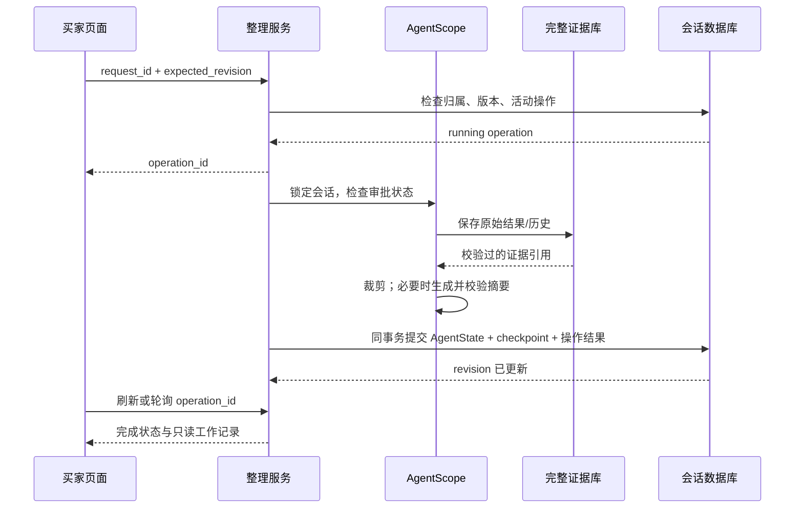

# 上下文分层治理与评测

## 2026-09-12 原文件路径纠正

此前将下划线版当作源文件的判断有误。已将44份文件（42篇教程、2份学习路线）的合并内容完整移回Git原来跟踪的路径，保留原有空格、括号和目录名称，清理下划线副本并更新引用。后续仅原位修改这些原文件，不再更换文件名或新增修订稿。下方关于“下划线源文件”的说法属于本次纠正前的过程记录，不是当前维护约定。

## 2026-09-12 教程源文件合并

教程以带下划线的42篇源文件维护。商品治理与摘要恢复并入05，评测并入14，买家恢复与订单闭环并入15；旧重复稿已合并。LoopDetector代码与讲解均保留。详细映射及文档检查见[教程实现对齐清单](教程实现对齐清单.md#tutorial-source-maintenance)。下方47篇与5篇新章为合并前的历史状态。


## 2026-09-11 教程局部修订与新章完善

按用户审核的混合方式完成：既有章节保留主要结构与教学案例，过时段落就地纠正，新能力插入对应小节，移除统一文末补充。重点10篇和关联16篇按清单处理，基础/训练等仅校准必要表述。5篇新章以原11/12章的课程目标、导读、案例、代码推导与验证方式完善，正文共47篇。

新章映射：05-1商品证据与工作集，05-2摘要/Checkpoint恢复，14-1完整成本评测，15-1买家持久恢复，15-2订单确认事务。06、17-4、19-5分别承载语义记忆、原生审批和个人Skill，避免重复扩章。

本轮只验证文档、示例与源码一致性，174个业务源码指纹未变；此前后端123、前端29项回归仅作为既有证据，未重复运行。默认Prompt旧记忆签名和Compose治理配置透传限制已明确，不修改业务源码来掩盖文档差异。输入35.85%来自独立36次完整成本实验，包含摘要与回查，不是生产成本承诺。

详细变更和本轮检查见 [教程调整与证据索引](<教程实现对齐清单.md#tutorial-source-maintenance>)。当前工程位于 `线上版本/项目工程/findora`；下方旧目录、44章或旧测试数量按历史日期阅读，不覆盖当前状态，也不以文档校验替代生产质量门禁。

---

## 交付状态

已实现分层治理、证据回查、工作状态、AgentScope 摘要适配、SQL 整理操作与 checkpoint、页面入口及恢复。自动策略默认 `legacy`；真实模型开发实验与留出验收是独立阶段，最终指标以 `eval/verification/context-20260910/` 的运行清单和报告为准，不用单测代替效果验收。

## 开发集结论

108 次运行完成：entry 28/36、after_use 36/36、pressure 35/36。pressure 的失败把第一批中国报价与后续日本报价混淆，按关键事实优先原则选定 after_use；entry 虽然更省输入，但存在 SKU/材质等遗漏，不能直接上线。置信区间仍较宽，不能声称已证明时机在所有任务上的普遍优势。

开发过程中补齐了整轮多搜索保护、相同报价条件的选中商品重复观察归档、工作状态原话提取和普通轮计时；最终实现另行冻结后进入留出集，不把两个阶段合并成同一实验。首次留出预检在代码复核发现缺省币种与数量歧义后中止，记录单独保留于 preflight；正式留出从新冻结版本重新运行，未复用预检答案。源码快照位于 `eval/verification/context-20260910/freeze/`。

## 数据与模型工作集

- `ContextEvidenceStore` 保存完整工具结果、查询条件、时间和 `display_batch`；展示批次来自与前端共用的候选投影，保留实际顺序。
- `AgentState.middle_context.globex_context` 保存带来源的本次工作状态、已读取输出指纹、同模型网关校准值、整理统计及 checkpoint 引用。预算和国家使用规则识别，其他已识别属性保留原句；无法识别的需求仍在原始对话和摘要中，不声称任意自然语言均已结构化。
- `SqlFencedSessionStore` 将 AgentState、checkpoint 和操作完成状态放在同一数据库事务内，沿用 revision/fence，失败不会提交半个检查点。原始证据先写入，整理失败允许留下未被引用的证据，不删除原件。
- 完整 AG-UI 聊天、商品历史和长期偏好使用原有数据库。工作状态属于本次任务，摘要不写入长期记忆；偏好删除后不能从历史摘要恢复。

## 分层策略

`context_products.py` 在入口去除图片、向量、调试等非业务字段，保留描述、规格、税费。异常巨大结果使用有明确总数、范围、后续游标的结构化分页；超大单字段使用可重组片段，不返回被截断的 JSON。

`LayeredContextMiddleware` 在 AgentScope 压缩阶段逐次检查工具结果。成功模型响应结束后才记录被读取输出的指纹，断流、失败和未读取结果不能当作已使用。保护当前轮及最近两个完整买家轮次、最近两个搜索结果、激活 Skill、未完成工具对。对普通结果，商品软预算 6,000 是触发整理的目标，不是保留批数上限。

旧重复观察先归档；去重键包括商品、SKU、目的地、币种、数量。选中/比较商品保留最新相关观察；同条件旧重复可归档，历史价格比较请求保留不同时间观察。原列表可以按引用恢复，不能把历史价用于下单。受保护内容过大时明确拒绝超出安全窗口的请求，买家可缩小范围或分批比较。

`conversation_fact_lookup` 支持 `result_ref / batch / position / product_id / sku_id / fields / offset / field_offset`。批次和位置从 1 开始，offset 从 0 开始；每页最多 5 件、约 3,000 token，字段组为 all、identity、specs、price。所有查询绑定当前买家与会话。回查输出也进入同一治理流程。

## 预算和摘要

统一估算最终系统提示、工具定义和消息，默认乘 1.5 保守系数，之后按相同模型及网关实际 input usage 校准；切换模型/网关重新开始。可用输入 = 模型窗口 − 至少 8,192 输出 − max(4,096, 5% 窗口)。目标为 min(48,000, 可用输入)，60% 清理旧提示，80% 尝试摘要，每次模型调用前检查安全容量。

先裁剪工具结果；已经释放足够空间则不调用摘要模型。可压缩消息至少新增 4 条。摘要复用 AgentScope 五字段合同及上一版摘要，精确业务工作状态独立保留。`ContextAwareAgent` 是 SDK 私有拆分行为的唯一适配层，当前测试版本为 2.0.6；升级 SDK 必须复验完整轮次、Skill 和工具配对。

摘要生成后校验商品/证据标识和部分金额库存来源，失败回滚。该检查是来源约束，不等于完整语义蕴含证明；实时查询和交易校验仍必须走业务工具。连续三次失败暂停自动摘要，手动重试或策略版本变化恢复。摘要自身输入放不进安全预算时，不触发 SDK 强删头部的兜底。

## 页面与接口

页面通过现有固定买家 `pao-coder` 查询。买家可以查看本次需求原话、最新预算、国家和关注/比较对象；继续对话修改。内部压缩摘要只代表已归档历史，不直接作为当前买家需求展示，避免旧国家/旧预算误导。

|接口|用途|
|---|---|
|`GET /commerce/context?buyer_id=...&session_id=...`|读取 revision、working、summary、statistics、checkpoint 和活动操作|
|`POST /commerce/context/compact`|JSON：buyer_id、session_id、request_id、expected_revision；返回操作|
|`GET /commerce/context/operations/{operation_id}?buyer_id=...`|查询 running / completed / noop / failed / interrupted|

相同 request_id 和 expected_revision 重试返回同一操作，版本不一致拒绝。运行中或待审批时拒绝手动整理。操作心跳每 5 秒续期、30 秒过期，重启/读取时把已过期操作标记 interrupted；不把其他进程仍在心跳的操作误判为中断。取消、写库失败、格式错误保留最后有效状态。当前手动整理要求 SQL 会话存储；旧文件存储配置明确返回不支持。

## 评测与复现

数据 `eval/context/cases.json` 共 40 个：开发集 12、留出集 28；32 个固定历史续答、8 个实际 20 轮长对话。每场景三策略、三次重复，总计 360。长对话在第 8/16 轮整理，第 12 轮从隔离 SQL 数据库重建 AgentState。目录、当前报价/订单/偏好为冻结工具夹具；模型和 AgentScope 真实调用，语义答案缓存关闭。

```bash
.venv/bin/python -m scripts.eval.run_context --split dev --output /tmp/context-dev
.venv/bin/python -m scripts.eval.report_context --input /tmp/context-dev --output eval/verification/context-20260910/dev
# 按开发集结果冻结 timing；不要根据留出答案再调参数
.venv/bin/python -m scripts.eval.run_context --split holdout --timing after_use --output /tmp/context-holdout
.venv/bin/python -m scripts.eval.report_context --input /tmp/context-holdout --output eval/verification/context-20260910/holdout
```

复验先复制 app、scripts/eval、data/catalog-v1.jsonl、eval/context/cases.json 到冻结目录，再使用同一个 Python 环境和模型环境变量运行。每场景使用隔离买家和数据库，不操作真实买家。`--resume` 要求源码指纹、模型、策略、场景和重复数完全匹配，否则拒绝混合结果。

报告按场景配对计算置信区间，保留原始答案和失败样本。人民币/RMB/CNY 作币种同义归一；数值不作模糊猜测。累计实际输入包含摘要以及回查后的模型调用。普通轮 P95 与整理轮、整场景耗时分开，未提供 usage 为未知。Langfuse/OTel 只追加策略、原因、前后估算、摘要版本和消耗等属性，不默认添加买家原文；当前回查单独统计工具次数，其后模型消耗计入业务调用总量。

交易写权限、审批恢复、跨买家隔离和浏览器恢复由生产代码集成测试另验，不能把只读夹具当作完整交易端到端验收。开发集与留出集不合并计算成功率。达不到无关键回归、C 成功率不低于 A、长对话实际输入下降 25%、普通轮 P95 劣化不超过 15% 的门禁时保留 legacy。

## 验证及回滚

专项回归覆盖未读取保护、整轮多搜索、选中商品重复观察、不同报价条件、分页重组、来源校验失败、三次断路、Skill 配对、SQL fence/CAS、幂等、权限和过期恢复。浏览器使用独立测试买家验证整理、刷新及重启后的原对话完整性，不修改 pao-coder 的使用数据。

回滚将 `CONTEXT_STRATEGY=legacy` 并重启 API 和所有 worker；无需删除/降级数据库表，checkpoint 和原始证据保留。自动新策略仅在验收后启用，手动整理入口独立可用。如需恢复某个历史 checkpoint，应通过校验 owner 和 revision 的维护流程；不手工覆盖数据库、不重放历史交易工具。

## 指标边界

固定历史 SKU/材质续答准确率不能冒充首次实际推荐正确率；本轮报告将首次推荐准确率和解释盲评明确标为未测。夹具会话的普通轮延迟包含网关排队，单独报告，不等于生产线上 P95。所有未知项都保留未知，不填零。

## 文件入口

|职责|实现|
|---|---|
|商品字段投影与分页、报价身份|`app/infrastructure/context_products.py`|
|整轮保护、读取标记、工作状态、分层摘要|`app/infrastructure/context_governance.py`|
|完整工具/展示批次证据|`app/infrastructure/persistence/context_evidence.py`|
|AgentState、checkpoint、操作事务|`app/infrastructure/persistence/sql/session_store.py`|
|手动整理服务与接口|`app/application/agents/context_service.py`、`app/presentation/context_workspace.py`|
|页面入口与刷新恢复|`frontend/src/components/ContextWorkspace.tsx`|
|场景、执行、统计|`scripts/eval/context_cases.py`、`run_context.py`、`report_context.py`|
|确定性回归|`tests/test_layered_context.py`、`tests/test_context_evaluation_report.py`|

## 一次整理如何提交



任何一步失败都不会删除原始聊天。证据先行落库与会话事务分开，允许出现尚未引用的证据，禁止出现已裁剪却没有原始证据的状态。手动整理不调用交易工具，也不把工作记录写入长期偏好。

交付时另补充了 `CONTEXT_CAPACITY_EXCEEDED` 的 AG-UI 明确提示与 56 项相关回归；该修改仅覆盖生产展示链路，冻结评测中的治理、摘要和预算算法未变。文件指纹差异见 `delivery-protocol-delta.json`。

## 评分的事实关联

正式报告除了检查 SKU、数值是否存在，还检查历史价/当前价、SKU/库存、SKU/单价、运费/税费的归属。属性标签后的首个目标数值需要与对应字段匹配；明确的后置费用公式标签也支持解析。无法确定关联时标为 unknown，不默认算安全通过。数字和 SKU 不做近似匹配。

明确的同义表达（人民币/RMB/CNY、已取消/CANCELLED、无相关长期偏好、不再要求、价格超出预算/太贵）统一归一，原始文本和原始检查始终保留。评分器回归包含历史/当前价格对调、黑/蓝库存对调和两商品单价互换等反例。

留出中已发现 C 组历史价与当前价归因颠倒的样本。核对其持久 AgentState 后，摘要本身仍保留历史单价129；错误发生在续答对历史证据与当前工具结果的归因阶段，不能简单断言为摘要写错数字。这些失败将阻断自动启用，并保留原始答案、摘要和数据库证据。最终数量以完整留出报告为准。

完成后可执行 `python -m scripts.eval.package_context --input <运行目录> --output <归档目录>`，生成报告、逐场景配对、原始结果、失败上下文、失败数据库压缩包和 SHA-256 清单。该命令检查完整运行组合和冻结状态，未完成实验不能生成正式归档。

## 最终验收（2026-09-10）

正式360次完成。开发集选定after_use；留出A 84/84、B 81/84、C 79/84。C相对A长对话实际输入增加31.71%，普通轮P95比值0.5314711967766526。门禁BLOCK，默认继续legacy。

完整报告、逐场景差异和失败证据见 [交付索引](../eval/verification/context-20260910/README.md)。首次实际推荐和独立盲评未测，不宣称已通过这些指标。

## 2026-09-10 二轮上下文修复状态

本次上下文专项通过并在本机启用layered/pressure。后端988通过、43跳过；真实接口、精确约束和选择、整理后原始聊天保留、重启恢复均验证。修复SKU字段/报价绑定、摘要合法来源、同句选中/排除以及问句覆盖约束，结构化摘要沿用AgentScope原生机制并补齐底层预算、限流和usage。

原开发108次/留出252次结果不覆盖；旧计量漏摘要，旧成本不用于验收。另完成21次预登记网络整组恢复，及36次独立长对话全成本复核；C完整输入下降35.85%，场景配对95%区间33.30%～38.85%，普通轮P95比值0.979。开发安全策略正确率相同且全成本证据不足，按预定规则默认pressure。全站检索/生产质量门禁不在本专项通过范围。

[完整报告、失败证据和回滚说明](../eval/verification/context-v2-20260910/README.md)。
