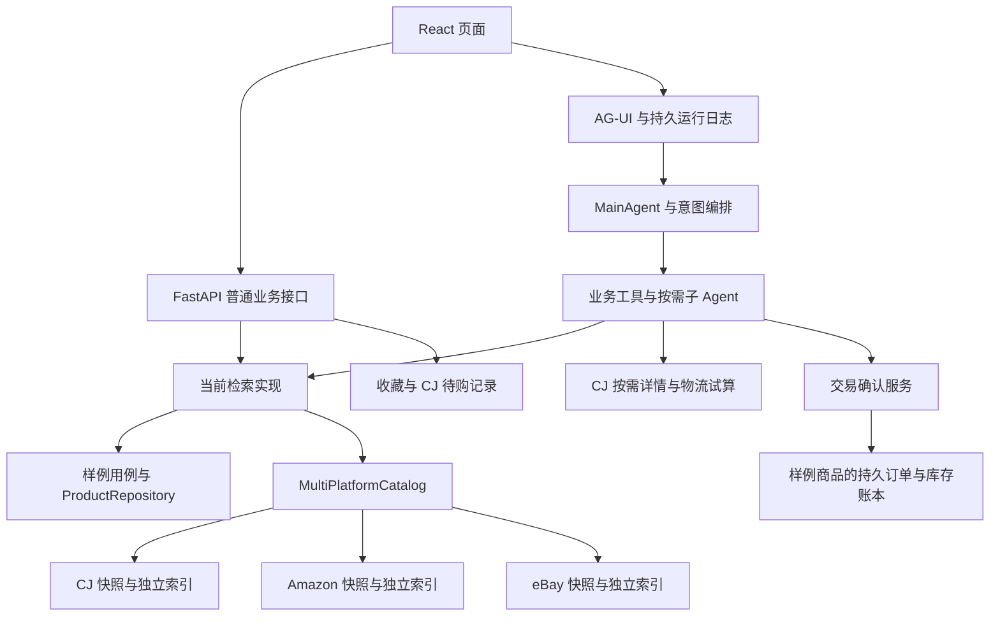

# Findora 全面架构审查（2026-10-08）

## 审查结论

四层目录、领域模型、Agent 工厂、交易确认、会话 fencing 与运行日志仍然存在，项目没有被整体推翻重写。但它已经从“样例目录上的购物与本地订单 Agent”，演进为“真实来源快照上的多平台选购、CJ 物流试算与外部购买辅助”。这个变化有业务理由，独立平台索引和中文展示投影也合理；问题集中在升级兼容、不同运行模式的能力契约，以及检索结果跨层传递。

本次发现 **9 项具体问题：4 项 P1、5 项 P2**。其中 7 项使用隔离数据动态复现，数据库路径另做配置选择复现，Compose 冲突由两份实际配置直接确认。现有回归通过也不能覆盖这些新增边界情况。建议先修复数据与部署问题，再收敛模块契约，暂不继续增加平台。

没有修改业务代码、运行中的服务、真实商品库或用户数据。审查新增本文及 `output/architecture-review-20261008/` 下的隔离证据；构建产生的跟踪缓存恢复为审查前内容。

## 1. 范围、依据与限制

- 审查版本：`main`，HEAD `12b6b89`。审查开始时工作区无跟踪文件改动。
- 比较依据：最早可用提交 `e4b9a75`、明确标记为 V1 的 `0aeb9cd`（decision workbench 前快照）、三平台接入前的 `1207c2d`，以及当前代码、README、设计演进记录、CJ/Amazon/eBay 文档和交接说明。
- 没有获得另一个 Agent 接手前的独立需求规格。因此可以判断历史设计与当前实现的差异，不能把每项差异都归因于某个 Agent，或认定已经违背未提供的用户授权。
- 检查覆盖后端领域/应用/基础设施/接口、前端请求/状态/目录/详情/决策/订单、装配与启动、导入与索引、现有测试及评测记录。不会声称逐条人工审核了全部商品或所有运行产物。
- 未调用真实 LLM、embedding、reranker 或 CJ 计点接口，未执行真实购买操作，未重新启动 Docker 栈；真实效果评测和远端依赖可用性不在本次证据范围内。
- P1 表示应优先修复的升级、数据或核心可用性问题；P2 表示明确的边界行为、接口或故障隔离缺陷。架构债务与已知能力缺口另列，不混同于已确认 Bug。

## 2. 架构变化与合理性

### 2.1 当前结构和调用关系

| 模块 | 实际职责 | 主要依赖 |
| --- | --- | --- |
| `app/domain`（29 个 Python 文件，含包初始化） | 商品/SKU/金额/地址/订单/偏好值对象、仓储与检索端口 | 标准库及本层模型；未发现指向应用、基础设施、接口或 AgentScope 的直接导入 |
| `app/application`（42 个文件） | Agent 工厂、意图编排、工具、决策报告、确认/订单用例、上下文维护 | 领域、AgentScope，以及大量具体基础设施 |
| `app/infrastructure`（73 个文件） | 三平台快照与中文库、Qdrant/embedding/reranker、SQL/文件存储、记忆、队列、追踪、上下文机制 | 外部库、领域端口；部分又依赖应用层 harness |
| `app/presentation`（14 个文件） | HTTP/WS/SSE、身份与会话归属、AG-UI 持久运行、目录与买家工作区 | 应用用例，同时直接引用具体基础设施 |
| `app/composition.py` | API 与旧队列 worker 的统一装配 | 上述各层；也直接创建接口层 AG-UI runtime |
| `frontend/src` | React 页面、结构化结果解析、会话恢复、确认与商品交互 | 同时使用 AG-UI 和普通 commerce HTTP 接口 |
| `scripts` / `eval` / `tests` | 快照采集/导入/中文化/启动/迁移；效果评测；回归 | 后端实现及隔离或真实运行环境 |

要点：多平台检索并没有共享领域 `ProductRepository`。CJ 模式的交易服务仍被装配，但它获得的是空的样例商品仓库。因而“能检索 CJ 商品”不等于“可以在本站对 CJ 商品创建订单”。

### 2.2 对历史设计的变化

| 设计方面 | 原有设计/历史依据 | 当前实现 | 判断 |
| --- | --- | --- | --- |
| 基本分层 | DDD 洋葱四层、装配根、仓储端口 | 目录保留，领域层仍干净 | 保留了基础结构，但不能据目录断言依赖方向严格成立 |
| 商品来源 | `CatalogSearchUseCase` 经 `ProductRepository` 查询样例聚合 | 三个基础设施类直接实现 `execute/browse/cards_by_ids`，由多平台类合并 | 扩展来源合理；缺少共享应用端口与统一结果契约 |
| 检索 | 二阶段向量/精排、关键词降级、硬约束与拒绝原因 | 独立平台集合、dense/BM25 RRF、全局一次精排、平台代表保留 | 索引隔离和统一精排合理；候选策略有越界和截断问题 |
| 计价 | 运税规则随检索内联，尽量减少模型工具轮次 | 快照报价不等于到手价，CJ 增加显式按需物流工具 | 真实数据费用不完整，拆出按需工具有理由，并非无依据的架构倒退 |
| 购买 | 样例商品生成确认，再执行本地订单与库存事务 | 样例交易保留；CJ 增加本地待购记录，三平台外部跳转 | 功能范围实质变化，需在能力表与交接文档明确 |
| 前后端传输 | WS 和 Redis 任务消费 | 页面主链为 AG-UI/SSE 和持久运行；旧 intents/WS/worker 保留 | 文档明确的兼容设计；两个入口不能默认被同一队列削峰 |
| 中文展示 | 原有样例中文商品 | 英文来源/索引与中文展示库分开、保留原文 | 合理，降低翻译修改价格和身份的风险 |
| 品牌改名 | Globex 标识 | Findora 标识；保留 Qdrant 集合和 UUID 命名空间 | 保留已有向量标识合理；持久数据库与 Redis 升级迁移尚不完整 |

相对 `0aeb9cd`，`app/frontend/docker/tests` 合计 136 个文件变化，新增 8,398 行、删除 585 行。这是持续功能扩展，规模明显超出单纯改名。应用层依赖基础设施、装配根创建 AG-UI runtime 等问题在旧提交中已有，不能全部算作近期新增退化。

## 3. 已确认问题与修复建议

### R1 · P1：默认数据库改名缺少升级保护，旧数据会被新空库遮蔽

**位置**：`app/infrastructure/settings.py:190`、`docker/docker-compose.yaml:66` 与 `:114`；相关脚本 `scripts/migrate_local_buyer.py:7`。

默认路径由 `globex.db` 改成 `findora.db`，但启动没有探测旧文件、拒绝新建或完成迁移。另一台机器/现有 Docker 卷若仅保存旧数据库，且未显式设置 `DATABASE_URL`，升级后就会创建并使用新数据库，原会话、订单、库存与所有权绑定不可见。旧文件本身仍在，这不是已经证明的数据被删除；也不能由本机已手工改名推断所有部署都安全。

买家迁移脚本只是遍历两种文件名并修改买家身份，**不负责把旧数据库切换为新数据库**。隔离探针在目录里仅放旧库，配置仍选择不存在的 `findora.db`。

**建议**：升级前显式保留原路径；或提供停服、备份、完整迁移及版本标记流程。启动同时遇到旧库和新库时要求明确选择，不能静默混合。验收需覆盖旧卷升级、两库并存和 WAL 未 checkpoint 的情况。

### R2 · P1：本地 Qdrant 能建库，却无法执行 CJ 混合检索

**位置**：`app/infrastructure/vector/qdrant_product_index.py:83`、`:164`；`app/infrastructure/persistence/cj_catalog.py:395`；`app/composition.py:157`。

未设置 `QDRANT_URL` 时，本地模式创建未命名 dense 集合；`hybrid_search()` 却要求命名为 `dense` 的集合，英文词面查询还要求服务端 BM25。设置 `CATALOG_SOURCE=cj` 和 `HYBRID_RECALL_ENABLED=1` 后，索引同步可返回成功、runtime 可标记 `ready`，但自然语言 CJ 查询报“检索暂不可用”。CJ 只对含明确编号的失败查询做精确回退；普通文字查询不会降级为关键词。

隔离测试使用实际嵌入式 Qdrant、两维虚构向量和一件虚构商品，确认 `bootstrap_ready=true` 后 `dog toy` 查询失败。Amazon/eBay 相同配置会回退关键词，但 CJ 会报错，造成平台行为差异。交接说明“各平台向量不可用均回退关键词”也与 CJ 实现冲突。

**建议**：为本地模式提供 dense-only 路径，或启动明确拒绝不支持的组合；runtime 应报告可执行的检索能力。是否在服务故障时对 CJ 自由文本降级，应与原有“不把故障伪装为无商品”原则统一，不能直接吞错返回空列表。

### R3 · P1：整批记录无效时，`--skip-invalid` 会成功清空已有快照

**位置**：`app/infrastructure/persistence/amazon_catalog.py:190`、`:209`；eBay 对应 `app/infrastructure/persistence/ebay_catalog.py:244`、`:263`。

默认替换导入中，全部记录验证失败且启用 `skip_invalid` 后，`normalized` 为空。导入器仍执行 `DELETE FROM ...`，插入零条，返回成功。原文件要求非空数组，但没有要求最终至少有一条有效商品。若采集批次全是失败记录或字段格式变化，旧库会被空库替换；下一次索引同步还可能删除原有向量。

真实 Amazon 导入器的隔离复现：原有 1 条商品，输入 1 条缺标题记录，导入成功并报告跳过 1 条，库存快照剩 0 条。eBay 有相同控制流程。使用 `--merge` 且旧数据有效时通常能保留旧条目，因此问题范围是替换模式，不应笼统声称所有导入都会丢失数据。

**建议**：零有效条目时保留原库并失败退出；需要清空目录应使用单独的显式动作。发布前同时校验有效条目数、拒绝比例与覆盖变化。

### R4 · P1：交接给出的完整 Compose 启动方式存在端口冲突与运行模式漂移

**位置**：`docker/docker-compose.yaml:94`、`:163`；`docker/docker-compose.cj.yaml:6`、`:38`、`:41`；交接说明 §5.5。

基础配置已有 `frontend` 绑定 `5173:80`，CJ 叠加配置又增加没有 profile 限制的 `frontend_prebuilt`，同样绑定 `5173:80`。按交接说明执行未指定服务的完整 `up -d --build`，两个前端都被启动，无法同时绑定同一端口。只启动 `app` 或手工选择服务的本机验收不会发现这个问题。

同一叠加层只把 API 配成 CJ，并关闭其队列/Redis；worker 仍沿用 fixture 和旧队列配置，Amazon/eBay 叠加也只作用于 API。若旧队列中尚有任务，worker 可以与网页使用不同商品世界。这与“共用装配避免行为漂移”的目标不符。CJ 使用带后缀的独立集合，因此这里不将 worker 的样例索引同步认定为会覆盖 API 的 CJ 商品集合。

**建议**：两个前端使用互斥 profile 或合并为一个服务；快照部署显式关闭不需要的 worker，或一致透传所有目录与上下文配置。验收检查完整服务集合和旧队列处理策略。本次根据真实配置确认冲突，未启动或修改现有容器。

### R5 · P2：多平台来源与局部故障信息在 Agent 商品事件中被丢弃

**位置**：`app/application/tools/product_search_tool.py:177`；下游 `app/application/agents/ag_ui_adapter.py:241`、`app/application/usecases/shopping_decision.py:293`。

`MultiPlatformCatalog.execute()` 返回 `source=multi`、`partial_results`、`source_status` 和 `data_scope`；商品工具发布 `tool.result` 时手工摘字段，漏掉这些信息。AG-UI 使用这个事件生成决策报告，因此对话工作台拿不到平台故障状态。包含 CJ 卡时，报告还会被归类为 `cj`；单独决策预览接口使用完整结果则正确归类为 `multi`。

隔离复现令 Amazon 失败：目录检索返回 `partial_results=true`，经过真实商品工具和 AG-UI adapter 后，报告不含 `partial_results`，`catalog_source=cj`。模型收到的完整工具内容仍可能说明故障，所以问题是结构化 UI 和后续事件投影丢失信息，而不是所有提示路径都消失。

**建议**：定义统一 SearchResult/事件 DTO，完整传递来源、范围、降级与平台状态；测试覆盖“目录查询→工具事件→AG-UI→刷新恢复”整条链，避免只测试直接预览接口。

### R6 · P2：保留平台代表的逻辑突破 `top_k`

**位置**：`app/infrastructure/persistence/multi_platform_catalog.py:157`。

三平台有命中而请求 `top_k=2` 时，逻辑为每个平台保留一件，共返回 3 件；平台代表数没有受总名额限制。商品工具允许请求 2 件，因而不是只出现在内部评测调用的无效输入。

**建议**：先分配不超过 K 的平台名额，再按排序补齐；明确 K 小于平台数时的策略，并覆盖 K=1/2/3/5。隔离复现为“请求 2，返回 3”。

### R7 · P2：先截断再排除不可购买商品，可能错误产生“无匹配”

**位置**：`app/infrastructure/persistence/multi_platform_catalog.py:156`；`app/application/usecases/shopping_decision.py:143`。

多平台合并先取 K 件，决策报告才排除 `snapshot_available=false` 的 Amazon/eBay 商品。若前 5 件都明确不可购买，第 6 件可购买，返回报告是 `no_match`，尽管召回集合中已有可用候选。原样例检索在截断前做库存/条件校验，这个原则没有在快照链路延续。

隔离复现为召回 6 件、返回 5 件、报告无候选，第 6 件被遗漏。结果不能用“无法核验所有库存”解释，因为这里使用的是明确的不可购买标记，而不是 unknown。

**建议**：在最终名额分配前排除已知不合格条目，保留拒绝原因；对仍需报告层验证的条件，保留足够候选并补齐可展示结果。

### R8 · P2：10 位纯数字 eBay 商品编号被优先识别为 Amazon ASIN

**位置**：`app/infrastructure/persistence/multi_platform_catalog.py:109`；`app/infrastructure/persistence/amazon_catalog.py:40`；eBay 编号规则 `app/infrastructure/persistence/ebay_catalog.py:27`。

Amazon matcher 接受带数字的任意 10 位字母数字串，eBay matcher 接受 9–15 位数字。对支持的 10 位纯数字 eBay 编号，两者都为真，而路由先判断 Amazon，于是查询错库。显式 `ebay:us:` 前缀通常能规避，当前常见 12 位 eBay 编号也不受此特定冲突影响；缺陷适用于当前代码声明接受的整个编号范围。

**建议**：先处理平台前缀，再处理无歧义纯数字编号；歧义编号应查验存在性或返回明确歧义结果，而不是依赖判断顺序。复现使用 `1234567890`。

### R9 · P2：平台故障隔离只实现于 Agent 检索，目录浏览会整体失败

**位置**：`app/infrastructure/persistence/multi_platform_catalog.py:56`；同类聚合 `:84`、`:96`。

`execute()` 使用 `return_exceptions=True` 并报告局部结果，`browse()` 使用普通 `gather`，任何一个平台读取失败都会使整个目录失败。前端启动还依赖 `/catalog?page_size=1` 判断是否启用多平台菜单，并静默捕获这个错误，因此平台故障可能同时隐藏目录入口。收藏本地化等聚合路径也缺少同等级隔离。

隔离复现中，同一个 Amazon 异常令搜索返回 CJ/eBay 局部结果，却令目录浏览抛异常。

**建议**：统一来源聚合的错误策略；目录返回健康平台与来源状态，精确编号查询可单独返回该平台失败；前端区分目录不可用和功能未启用。

## 4. 架构一致性和代码质量债务

### D1：目录是四层，依赖方向尚未收敛

当前应用层 23/42 个文件包含共 77 条指向 `app.infrastructure` 的 `from` 导入，既有事件/上下文/模型工厂，也有具体证据存储、CJ 服务与治理实现。基础设施 harness 又反向导入应用层判定器。这些既有类型注解，也有运行时使用，不能把全部 77 条都当成同等程度的耦合。

最值得先收敛的是：为检索、证据、运行上下文和事件发布建立应用端口；把通用上下文业务规则和排序策略从具体存储/框架实现中分出。领域层保持干净值得保留，不建议为“看起来更分层”大范围重写已经验证的交易底座。

### D2：平台适配器包揽业务编排，Amazon/eBay 有大量平行实现

两个 catalog 均包含 `_amount/_text`、批次导入、整库读取、本地化投影、关键词分词、文档缓存、embedding 双查询、RRF 调用、品类 boost、rerank 校验、预算过滤与结果构造；两个 localization 的实现也基本相同，只换版本与类目表。

重复不只是命名问题：R3 的空批次覆盖缺陷已在两平台重复出现；平台来源过滤、故障和预算行为很容易分别演进。建议提取共享检索/导入/展示投影流程，平台保留 ID、URL、源字段和分类映射；避免用巨型继承类再次耦合所有平台。

### D3：契约依赖 duck typing 与具体类型判断

SearchAgentFactory/商品工具参数标注 `CatalogSearchUseCase`，实际可能注入 `CJCatalog` 或 `MultiPlatformCatalog`。各方没有共用定义 `execute/browse/cards_by_ids/localize_saved_cards` 的端口。接口层通过 `isinstance` 判断快照类型，购买记录接口还直接拆出 `.cj`，多平台类修改 `cj.reranker=None`，形成实现细节耦合。

建议定义检索/目录访问端口与平台能力表，以能力决定详情、运费、站内确认和待购记录入口。它还能明确“仅 CJ 可提供物流试算”和“只有 fixture 支持本站交易”的不同语义。

### D4：升级与数据生命周期缺少统一操作规程

除 R1 外，Redis 流、消费组、状态/租约 key 已从 `globex:*` 改为 `findora:*`，代码未见旧任务的搬迁或消费兼容。若升级时旧流仍有 pending/queued 任务，新 worker 不会自动处理它们；需要停接单、排空或显式迁移，不能据新版本测试通过认定升级无损。JWT 用途/issuer/audience 也变更，旧令牌需要重新签发。

会话/交易、运行日志、记忆、Skill、证据、Prompt、收藏、待购记录和 CJ 试算分散在多个 SQLite 文件。分库有隔离价值，但全量备份、买家迁移、schema 升级与数据保留需覆盖所有权威库。当前买家迁移文件列表未包括新增 `purchase_records.sqlite3` 和 file 模式 `trade.db`，应单独补齐适用范围。

### D5：前端与运行组件职责集中，配置矩阵不足

`commerceClient.ts` 1,067 行承担 DTO 校验、浏览器缓存、买家/会话历史、SDK 生命周期、恢复、审批、决策和普通工作区请求；`App.tsx` 825 行承担页面切换及多业务状态；后端 orchestrator 667 行。行数只是维护成本信号，不是独立 Bug。

建议按明确职责拆分状态/传输/DTO/各业务 client，保留现有跨会话迟到事件防护。为 fixture/CJ/multi × local/server Qdrant × native/Compose × API/worker 建少量契约验证，比继续增加只测单平台 happy path 的用例更有价值。

### D6：测试资料的文本编码依赖宿主机

`tests/test_prompt_registry.py:32` 用未指定 encoding 的 `write_text()` 写中文 YAML，而生产读取器将 bytes 按 UTF-8 解析；`tests/test_eval_v1_fixture.py` 使用未指定 encoding 的 `read_text()` 读取 UTF-8 数据。Windows 默认 GBK 下造成 33 项 setup error 和 7 项失败，切换 UTF-8 后相关测试全部通过。应为这些资料读写固定 UTF-8，并在验证说明中明确环境；这是验证可复现性问题，本次没有把它列为已确认的交易或检索逻辑缺陷。

## 5. 功能完整性核对

| 功能 | 当前结论 | 需要明确的限制/缺口 |
| --- | --- | --- |
| 样例商品订单与库存 | 用例及事务底座仍在，创建/取消均经 HTTP 确认 | 不等于已支付或外部商家下单；不应删除这条已验证链路 |
| CJ/Amazon/eBay 快照检索 | 已有独立来源/索引和聚合 | R2/R5–R9 影响运行模式、展示与边界查询 |
| 快照目录浏览与平台筛选 | 已实现 | R9 故障不隔离；仅 CJ 模式的 API `platform=ebay` 分支未像 `amazon` 一样返回空列表，会返回 CJ 内容（静态确认的小接口不一致，未单列优先问题） |
| 中文展示及原文保留 | 已实现来源指纹与独立投影 | 派生库缺失可回退英文；跨字段验证不能等同人工核验所有商品 |
| CJ 详情与物流试算 | 代码与测试存在，显式请求才调用 | 按指定规格和目的地；并非完整税费/最终支付价；共享额度仅适合当前单进程试运行边界 |
| CJ 站内交易 | **未实现** | 空 ProductRepository、Prompt 禁止 CJ create_order、前端只提供待购/外跳；旧 TradeAgent 工具仍注册，能力表达未收敛 |
| Amazon/eBay 站内交易 | 按设计禁用，外部链接有平台与编号校验 | 未取得真实跨境费用；不能宣称同款最低到手价 |
| CJ 待购记录 | 有独立持久存储和页面 | 不是订单；不覆盖 Amazon/eBay；买家迁移范围需补齐 |
| 会话/审批/偏好/Skill/刷新恢复 | 主链仍在，多层保护与测试充分 | AG-UI 与旧 intents/WS/worker 的吞吐、取消与缓存语义不同；应分别陈述 |
| 硬预算、材质、配送 | fixture 支持结构化校验；快照大部分保持 unknown | 快照只对 USD 商品价上限做已知价格过滤，默认 CNY 预算并不实际完成换汇筛选；UI/工具说明不能泛称全模式硬约束均生效 |
| 正式质量验收 | 仓库仍记录未通过项 | 历史 release 文档不是本版本的正式重跑结果；未见足以确认三平台完整正式门禁通过的证据 |

**文档需纠正**：`docs/项目交接说明-2026-10-07.md:18` 声称“只有 CJ 支持站内结算”，与 `README`、CJ 数据采集文档、Prompt、前端和空仓库接线冲突。正确表述应区分 fixture 的本地交易、CJ 的试算/待购记录，以及三平台外跳。根目录 `HANDOFF.md` 又保留早期 143 条 Amazon、未提交、HEAD `1207c2d` 的交接状态，应标记为历史档案或链接唯一当前交接入口。

跨平台同款映射、Amazon/eBay 跨境运税、实时库存和外部订单同步是明确未完成能力。它们影响“跨平台真实到手比价/交易”目标，但当前代码大多如实标 unknown，本次不把这些已经声明的边界伪装成突然新增 Bug。

## 6. 验证与处理顺序

### 验证证据

- 当前测试集合收集到 1,192 项。完整执行结果为 **1,109 passed / 43 skipped / 7 failed / 33 errors**，耗时 390.75 秒；全部 40 项异常位于上述 GBK/UTF-8 资料读写问题。
- 使用 `PYTHONUTF8=1`、`PYTHONIOENCODING=utf-8`，复测 `test_prompt_registry.py`、`test_eval_v1_fixture.py` 与 `test_eval_selection_manifest.py`，**66 passed**，耗时 27.67 秒，覆盖全部 40 项异常。完整执行与异常复测之间未改业务代码；两次验证合计覆盖 1,149 项通过和 43 项跳过，**不是一次单独全量执行的全绿结果**。
- 前端：14 个测试文件、**122 passed**；生产构建通过。
- 隔离复现使用 `output/architecture-review-20261008/review_probes.py`，结果保存在同目录 `probe-results.json`。不调用真实模型/向量网关/CJ API，真实嵌入式 Qdrant 仅写专用临时目录。
- 全量测试最初的临时目录父路径不存在，产生 setup error，已经更正，不能把这些错误计为业务失败。前端初次沙箱读取依赖出现 EPERM，在允许的测试环境重跑通过。后端曾在接口测试处停顿，该测试单独通过；后续带诊断完整重跑，结论以最终日志为准。
- 现有正式 release 记录为历史 BLOCKED；本次回归、构建和隔离复现不替代真实质量门禁。

证据文件（均位于 `output/architecture-review-20261008/`）：

| 文件 | 内容 |
| --- | --- |
| `probe-results.json` / `review_probes.py` | 9 项问题的隔离或静态配置证据与复现入口 |
| `backend-complete.log` | 完整 1,192 项执行、编码异常的堆栈与统计 |
| `backend-utf8-focused.log` | 66 项 UTF-8 复测及全部异常消除 |
| `output-architecture-review-frontend-verified.log` | 前端 122 项通过 |
| `output-architecture-review-build.log` | TypeScript 与生产打包成功 |
| `route-diagnostic.log` | 曾停顿的单个订单接口用例独立通过 |

43 项 skipped 保持原测试条件，本次不能据此声称所有 Redis 重启、远端模型和外部服务集成都重新验收。审查目录还保留最初的环境失败/中止日志，最终结论以上表为准。

### 建议处理顺序

1. **先保护升级与发布**：R1 数据库选择/迁移、R3 空批次替换保护、R4 互斥部署与 worker 模式。
2. **恢复一致的检索能力**：R2 本地索引能力契约、R5 结果 DTO、R6/R7 名额与过滤顺序、R8 编号消歧、R9 来源故障隔离。
3. **修正文档与能力入口**：fixture/CJ/multi 的能力表、唯一交接入口、旧队列排空/迁移规范、买家迁移覆盖新增库。
4. **再做局部结构收敛**：共享平台流程与应用端口、前端 client 拆分；不重写已通过原子交易/幂等/fencing 验证的底座。
5. **最后验收效果**：冻结三平台数据与版本，分别验证检索、中文跨语言查询、已知约束、局部故障和真实 Agent 链路；对未取得数据的能力继续保持明确 unknown。

下一轮的完成标准应是“升级可读取旧数据、无效批次不会抹空快照、文档启动方式一致、同一检索在普通接口与对话报告里保持同一来源/故障事实、K 与可用性契约成立”，而不只是继续增加通过的测试数量。
